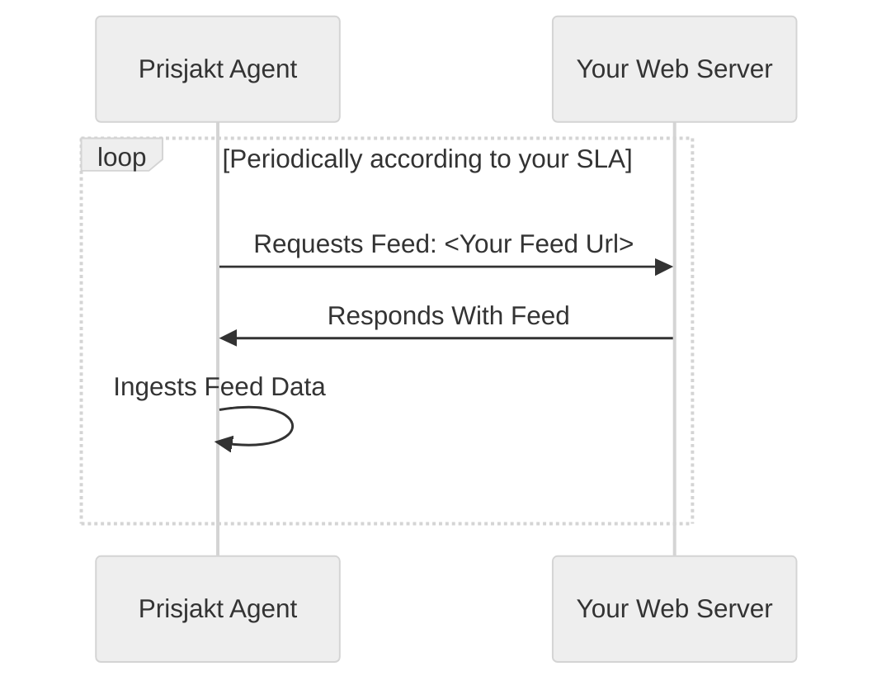
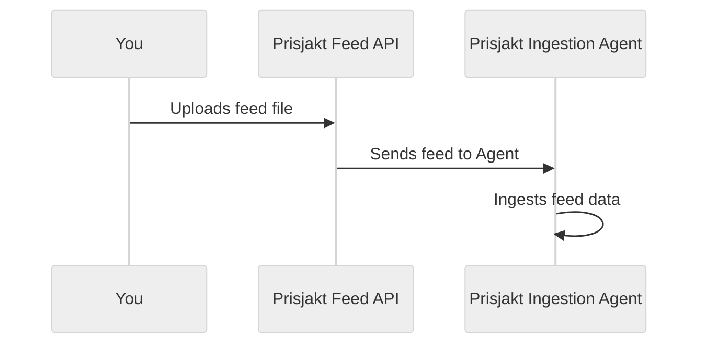

# Feeds

```mdx-code-block
import DocCardList from '@theme/DocCardList';

<DocCardList />
```

## Feed Types

We support feeds for different types of integration with us. 

- **Offer feed** is the most common feed type, compatible with Google Merchant Feed and is the way shops provide us with prices and stock status.
- **Product feed** is intended for manufacturers who wants to provide us with detailed product information of the products they create.
- **Promotion feed** is a way for shops to automate promotion campaigns through us. Visible at [the promotions page](https://prisjakt.nu/kampanjer).
- **Local store feed** is for you who have stores in multiple physical locations. This feeds helps us define your store information such as opening hours and address.
- **Local inventory feed** is use in conjunction with Local Store Feeds to provide local-specific availability, prices and shipping options.

## Pull Based Delivery Flow

The default flow of reding the feeds is simply that you provide an URL to us and we will periodically read it and update it. Frequency depends on the type of feed and your SLA level.



## Push Based Delivery Flow

It is also possible to upload the feed to us, either via the user iterface in **Business Center** or via our Feed API (contact support for credentials).

