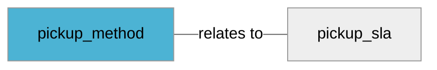

import Tabs from '@theme/Tabs';
import TabItem from '@theme/TabItem';
import Anchor from "@site/src/components/anchor"
import Field from '@site/docs/partials/_field.mdx';
import ReactMarkdown from 'react-markdown';
import ChangeLog from '@site/src/components/changelog';
import OptionalField from '@site/docs/partials/_optional_field.md';

# pickup_method

<OptionalField/>

## Description

Specifies what available pickup options exists for your store.


## Related Fields




## Allowed Enum Values

<dl>
<dt>
      <pre>
      <code>
      buy
      </code>
      </pre>
    </dt>
    <dd>
    <ReactMarkdown>
      {`The entire transaction occurs online.`}
    </ReactMarkdown>
    </dd>
<dt>
      <pre>
      <code>
      reserve
      </code>
      </pre>
    </dt>
    <dd>
    <ReactMarkdown>
      {`The item is reserved online and the transaction occurs in-store.`}
    </ReactMarkdown>
    </dd>
<dt>
      <pre>
      <code>
      ship to store
      </code>
      </pre>
    </dt>
    <dd>
    <ReactMarkdown>
      {`The item is purchased online and shipped to a local store for the customer to pick up.`}
    </ReactMarkdown>
    </dd>
<dt>
      <pre>
      <code>
      not supported
      </code>
      </pre>
    </dt>
    <dd>
    <ReactMarkdown>
      {`The item is not available for store pickup.`}
    </ReactMarkdown>
    </dd>
</dl>


## Validation Rules

- Value must be one of the allowed enum values


## Example Values

Here are examples of how a valid *pickup_method* value  should look like in XML and CSV (with header) respectively.

<Tabs>
  <TabItem value="valid_xml" label="XML" default>

:::tip Valid Value

```xml
<g:pickup_method>buy</g:pickup_method>
```

:::

<details>
  <summary>Click to show more valid XML examples</summary>
  <div>

```xml
<g:pickup_method>buy</g:pickup_method>
```

```xml
<g:pickup_method>reserve</g:pickup_method>
```

```xml
<g:pickup_method>ship_to_store</g:pickup_method>
```

```xml
<g:pickup_method>not_supported</g:pickup_method>
```


  </div>
</details>

 </TabItem>
  <TabItem value="valid_csv" label="CSV">

:::tip Valid Value

```csv
pickup_method
buy
```

:::

<details>
  <summary>Click to show more valid CSV examples</summary>
  <div>

```csv
pickup_method
buy
```

```csv
pickup_method
reserve
```

```csv
pickup_method
ship_to_store
```

```csv
pickup_method
not_supported
```


  </div>
</details>

  </TabItem>
</Tabs>

## Error Codes

Below you will find possible error codes generated when validating this field alongside with an example in XML and CSV that would trigger the code. Please refer to the [validation rules](#validation-rules) to understand the cause.

<Tabs>
  <TabItem value="invalid_xml" label="XML" default>


 </TabItem>
  <TabItem value="invalid_csv" label="CSV">


  </TabItem>
</Tabs>

## Properties

|     **Property** |         **Value**          | **Description**                                              |
|-----------------:|:--------------------------:|:-------------------------------------------------------------|
|        Data Type |    **enum**     | Closest data type in code                                    |
|           Nested |      **False**      | Defines if this field consists of one or more sub-fields     |
|   Case Sensitive |  **True**  | If small or large letters matter for this field              |
|       Repeatable |    **False**    | If you can supply multiple items of this field (it´s a list) |
| Repeatable limit | **0** | If a list, this specifices the max number of items           |

## Changelog
<ChangeLog versionHistory={[{"added": ["Initial definition"], "date": "2025-02-24"}]} dateOnly={true} />

## References
- [Google Local Inventory Data Specification For This Field](https://support.google.com/merchants/answer/14634021?sjid=12668122117297241362-EU)
- [Google Local Inventory Data Specification](https://support.google.com/merchants/answer/14819809?hl=en)
