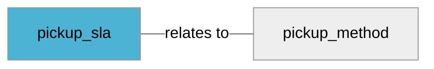

import Tabs from '@theme/Tabs';
import TabItem from '@theme/TabItem';
import Anchor from "@site/src/components/anchor"
import Field from '@site/docs/partials/_field.mdx';
import ReactMarkdown from 'react-markdown';
import ChangeLog from '@site/src/components/changelog';
import OptionalField from '@site/docs/partials/_optional_field.md';

# pickup_sla

<OptionalField/>

## Description

Specifies the expected date when an order will be ready for pickup, relative to when the order is placed.


## Related Fields




## Allowed Enum Values

<dl>
<dt>
      <pre>
      <code>
      same day
      </code>
      </pre>
    </dt>
    <dd>
    <ReactMarkdown>
      {`Indicates that the product is available for pickup the same day that the order is placed, subject to cut off times.`}
    </ReactMarkdown>
    </dd>
<dt>
      <pre>
      <code>
      next day
      </code>
      </pre>
    </dt>
    <dd>
    <ReactMarkdown>
      {`Indicates that the product is available for pickup the following day that the order is placed.`}
    </ReactMarkdown>
    </dd>
<dt>
      <pre>
      <code>
      2-day
      </code>
      </pre>
    </dt>
    <dd>
    <ReactMarkdown>
      {`Indicates that the product will be shipped to a store for a customer to pick up in 2 days.`}
    </ReactMarkdown>
    </dd>
<dt>
      <pre>
      <code>
      3-day
      </code>
      </pre>
    </dt>
    <dd>
    <ReactMarkdown>
      {`Indicates that the product will be shipped to a store for a customer to pick up in 3 days.`}
    </ReactMarkdown>
    </dd>
<dt>
      <pre>
      <code>
      4-day
      </code>
      </pre>
    </dt>
    <dd>
    <ReactMarkdown>
      {`Indicates that the product will be shipped to a store for a customer to pick up in 4 days`}
    </ReactMarkdown>
    </dd>
<dt>
      <pre>
      <code>
      5-day
      </code>
      </pre>
    </dt>
    <dd>
    <ReactMarkdown>
      {`Indicates that the product will be shipped to a store for a customer to pick up in 5 days.`}
    </ReactMarkdown>
    </dd>
<dt>
      <pre>
      <code>
      6-day
      </code>
      </pre>
    </dt>
    <dd>
    <ReactMarkdown>
      {`Indicates that the product will be shipped to a store for a customer to pick up in 6 days.`}
    </ReactMarkdown>
    </dd>
<dt>
      <pre>
      <code>
      multi-week
      </code>
      </pre>
    </dt>
    <dd>
    <ReactMarkdown>
      {`Indicates that the product will be shipped to a store for a customer to pick up in one week or more.`}
    </ReactMarkdown>
    </dd>
</dl>


## Validation Rules

- Required to enable store pickup
- Value must be one of the allowed enum values


## Example Values

Here are examples of how a valid *pickup_sla* value  should look like in XML and CSV (with header) respectively.

<Tabs>
  <TabItem value="valid_xml" label="XML" default>

:::tip Valid Value

```xml
<g:pickup_sla>same day</g:pickup_sla>
```

:::

<details>
  <summary>Click to show more valid XML examples</summary>
  <div>

```xml
<g:pickup_sla>same day</g:pickup_sla>
```

```xml
<g:pickup_sla>next day</g:pickup_sla>
```

```xml
<g:pickup_sla>2-day</g:pickup_sla>
```

```xml
<g:pickup_sla>3-day</g:pickup_sla>
```

```xml
<g:pickup_sla>4-day</g:pickup_sla>
```

```xml
<g:pickup_sla>5-day</g:pickup_sla>
```

```xml
<g:pickup_sla>6-day</g:pickup_sla>
```

```xml
<g:pickup_sla>multi-week</g:pickup_sla>
```


  </div>
</details>

 </TabItem>
  <TabItem value="valid_csv" label="CSV">

:::tip Valid Value

```csv
pickup_sla
same day
```

:::

<details>
  <summary>Click to show more valid CSV examples</summary>
  <div>

```csv
pickup_sla
same day
```

```csv
pickup_sla
next day
```

```csv
pickup_sla
2-day
```

```csv
pickup_sla
3-day
```

```csv
pickup_sla
4-day
```

```csv
pickup_sla
5-day
```

```csv
pickup_sla
6-day
```

```csv
pickup_sla
multi-week
```


  </div>
</details>

  </TabItem>
</Tabs>

## Error Codes

Below you will find possible error codes generated when validating this field alongside with an example in XML and CSV that would trigger the code. Please refer to the [validation rules](#validation-rules) to understand the cause.

<Tabs>
  <TabItem value="invalid_xml" label="XML" default>


 </TabItem>
  <TabItem value="invalid_csv" label="CSV">


  </TabItem>
</Tabs>

## Properties

|     **Property** |         **Value**          | **Description**                                              |
|-----------------:|:--------------------------:|:-------------------------------------------------------------|
|        Data Type |    **enum**     | Closest data type in code                                    |
|           Nested |      **False**      | Defines if this field consists of one or more sub-fields     |
|   Case Sensitive |  **True**  | If small or large letters matter for this field              |
|       Repeatable |    **False**    | If you can supply multiple items of this field (it´s a list) |
| Repeatable limit | **0** | If a list, this specifices the max number of items           |

## Changelog
<ChangeLog versionHistory={[{"added": ["Initial definition"], "date": "2025-02-24"}]} dateOnly={true} />

## References
- [Google Local Inventory Data Specification For This Field](https://support.google.com/merchants/answer/14635400?sjid=12668122117297241362-EU)
- [Google Local Inventory Data Specification](https://support.google.com/merchants/answer/14819809?hl=en)
