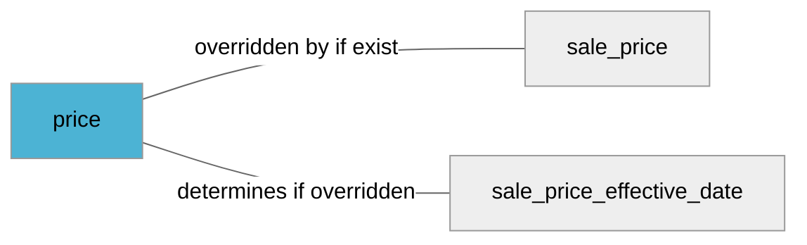

import Tabs from '@theme/Tabs';
import TabItem from '@theme/TabItem';
import Anchor from "@site/src/components/anchor"
import Field from '@site/docs/partials/_field.mdx';
import ReactMarkdown from 'react-markdown';
import ChangeLog from '@site/src/components/changelog';
import OptionalField from '@site/docs/partials/_optional_field.md';

# price

<OptionalField/>

## Description

Your products price in the specific shop referenced by [`store_code`](/feeds/fields/local-offer/store_code.md).


## Related Fields




## Validation Rules

- Must be a number (value) followed by a space and a currency (unit)
- Number *may* have **two decimals**, separated by a `.` (dot)
- Currency must be three upper case characters and a valid [ISO 4217](https://en.wikipedia.org/wiki/ISO_4217) currency
- Zero prices are **not** allowed


## Best Practices


### Do

- Submit price if your item has a different price per shop
- The inventory data price will override the price in the product data feed for the associated shop.
- Accurately submit the product's price and currency, and match with the price from your shops
- Ensure that the product can be purchased in-shop for the submitted price.
- For products sold in bulk quantities, bundles, or multipacks: Submit the total price of the minimum purchasable quantity, bundle, or multipack.
- For the US and Canada: Don't include tax in the price.
- For all other countries:Include value added tax (VAT) or Goods and Services Tax (GST) in the price.


### Don´t

- Do **not** include extra charges in the cost (such as shipping cost)
- Do **not** use thousand separators or similar in the value (while we may handle some of these cases we recommend you to just send plain numbers like `10000.50 SEK`)


## Example Values

Here are examples of how a valid *price* value  should look like in XML and CSV (with header) respectively.

<Tabs>
  <TabItem value="valid_xml" label="XML" default>

:::tip Valid Value

```xml
<g:price>99.99 SEK</g:price>
```

:::

<details>
  <summary>Click to show more valid XML examples</summary>
  <div>

```xml
<g:price>99.99 SEK</g:price>
```

```xml
<g:price>100 SEK</g:price>
```

```xml
<g:price>SEK 100</g:price>
```

```xml
<g:price>99,99 SEK</g:price>
```

```xml
<g:price>10,000.00 SEK</g:price>
```

```xml
<g:price>10 000.00 SEK</g:price>
```

```xml
<g:price>10.000 SEK</g:price>
```

```xml
<g:price>1.144.000 SEK</g:price>
```


  </div>
</details>

 </TabItem>
  <TabItem value="valid_csv" label="CSV">

:::tip Valid Value

```csv
price
99.99 SEK
```

:::

<details>
  <summary>Click to show more valid CSV examples</summary>
  <div>

```csv
price
99.99 SEK
```

```csv
price
100 SEK
```

```csv
price
SEK 100
```

```csv
price
"99,99 SEK"
```

```csv
price
"10,000.00 SEK"
```

```csv
price
10 000.00 SEK
```

```csv
price
10.000 SEK
```

```csv
price
1.144.000 SEK
```


  </div>
</details>

  </TabItem>
</Tabs>

## Error Codes

Below you will find possible error codes generated when validating this field alongside with an example in XML and CSV that would trigger the code. Please refer to the [validation rules](#validation-rules) to understand the cause.

<Tabs>
  <TabItem value="invalid_xml" label="XML" default>

:::danger[**<Anchor id="validation_missing_currency" title="validation_missing_currency" />**]


```xml
<g:price>100$</g:price>
```

:::

:::danger[**<Anchor id="validation_missing_price_value" title="validation_missing_price_value" />**]


```xml
<g:price>SEK</g:price>
```

:::

:::danger[**<Anchor id="validation_missing_value" title="validation_missing_value" />**]


```xml
<g:price></g:price>
```

:::

:::danger[**<Anchor id="validation_not_number" title="validation_not_number" />**]


```xml
<g:price>10.0.00.00 SEK</g:price>
```
```xml
<g:price>10.0.00.00 SEK</g:price>
```
```xml
<g:price>foo SEK</g:price>
```

:::

:::danger[**<Anchor id="validation_not_positive_number" title="validation_not_positive_number" />**]


```xml
<g:price>-10 SEK</g:price>
```
```xml
<g:price>0 SEK</g:price>
```

:::

:::danger[**<Anchor id="validation_price_out_of_range" title="validation_price_out_of_range" />**]


```xml
<g:price>1000000000 SEK</g:price>
```

:::

:::danger[**<Anchor id="validation_unknown_currency" title="validation_unknown_currency" />**]


```xml
<g:price>$100</g:price>
```

:::


 </TabItem>
  <TabItem value="invalid_csv" label="CSV">

:::danger <Anchor id="validation_missing_currency" title="validation_missing_currency" />

```csv
price
100$
```

:::

:::danger <Anchor id="validation_missing_price_value" title="validation_missing_price_value" />

```csv
price
SEK
```

:::

:::danger <Anchor id="validation_missing_value" title="validation_missing_value" />

```csv
price
""
```

:::

:::danger <Anchor id="validation_not_number" title="validation_not_number" />

```csv
price
10.0.00.00 SEK
```
```csv
price
10.0.00.00 SEK
```
```csv
price
foo SEK
```

:::

:::danger <Anchor id="validation_not_positive_number" title="validation_not_positive_number" />

```csv
price
-10 SEK
```
```csv
price
0 SEK
```

:::

:::danger <Anchor id="validation_price_out_of_range" title="validation_price_out_of_range" />

```csv
price
1000000000 SEK
```

:::

:::danger <Anchor id="validation_unknown_currency" title="validation_unknown_currency" />

```csv
price
$100
```

:::


  </TabItem>
</Tabs>

## Properties

|     **Property** |         **Value**          | **Description**                                              |
|-----------------:|:--------------------------:|:-------------------------------------------------------------|
|        Data Type |    **price**     | Closest data type in code                                    |
|           Nested |      **False**      | Defines if this field consists of one or more sub-fields     |
|   Case Sensitive |  **True**  | If small or large letters matter for this field              |
|       Repeatable |    **False**    | If you can supply multiple items of this field (it´s a list) |
| Repeatable limit | **0** | If a list, this specifices the max number of items           |

## Changelog
<ChangeLog versionHistory={[{"added": ["Initial definition"], "date": "2025-02-24"}]} dateOnly={true} />

## References
- [Google Local Inventory Data Specification For This Field](https://support.google.com/merchants/answer/6324371?sjid=12668122117297241362-EU&visit_id=638760023831624244-3736320015&rd=1)
- [Google Local Inventory Data Specification](https://support.google.com/merchants/answer/14819809?hl=en)
