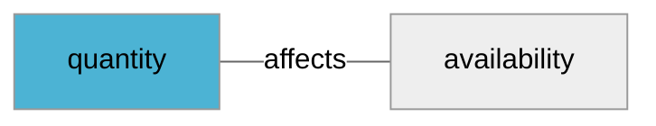

import Tabs from '@theme/Tabs';
import TabItem from '@theme/TabItem';
import Anchor from "@site/src/components/anchor"
import Field from '@site/docs/partials/_field.mdx';
import ReactMarkdown from 'react-markdown';
import ChangeLog from '@site/src/components/changelog';
import OptionalField from '@site/docs/partials/_optional_field.md';

# quantity

<OptionalField/>

## Description

The number of items in stock for the store


## Related Fields




## Validation Rules

- Must be in sync with the enums of [`availability`](/feeds/local-offer/fields/availability.md)
- Must not be negative


## Example Values

Here are examples of how a valid *quantity* value  should look like in XML and CSV (with header) respectively.

<Tabs>
  <TabItem value="valid_xml" label="XML" default>

:::tip Valid Value

```xml
<g:quantity>100</g:quantity>
```

:::

<details>
  <summary>Click to show more valid XML examples</summary>
  <div>

```xml
<g:quantity>100</g:quantity>
```


  </div>
</details>

 </TabItem>
  <TabItem value="valid_csv" label="CSV">

:::tip Valid Value

```csv
quantity
100
```

:::

<details>
  <summary>Click to show more valid CSV examples</summary>
  <div>

```csv
quantity
100
```


  </div>
</details>

  </TabItem>
</Tabs>

## Error Codes

Below you will find possible error codes generated when validating this field alongside with an example in XML and CSV that would trigger the code. Please refer to the [validation rules](#validation-rules) to understand the cause.

<Tabs>
  <TabItem value="invalid_xml" label="XML" default>


 </TabItem>
  <TabItem value="invalid_csv" label="CSV">


  </TabItem>
</Tabs>

## Properties

|     **Property** |         **Value**          | **Description**                                              |
|-----------------:|:--------------------------:|:-------------------------------------------------------------|
|        Data Type |    **integer**     | Closest data type in code                                    |
|           Nested |      **False**      | Defines if this field consists of one or more sub-fields     |
|   Case Sensitive |  **True**  | If small or large letters matter for this field              |
|       Repeatable |    **False**    | If you can supply multiple items of this field (it´s a list) |
| Repeatable limit | **0** | If a list, this specifices the max number of items           |

## Changelog
<ChangeLog versionHistory={[{"added": ["Initial definition"], "date": "2025-02-24"}]} dateOnly={true} />

## References
- [Google Local Inventory Data Specification For This Field](https://support.google.com/merchants/answer/13475891?sjid=12668122117297241362-EU)
- [Google Local Inventory Data Specification](https://support.google.com/merchants/answer/14819809?hl=en)
