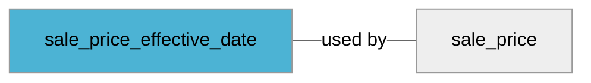

import Tabs from '@theme/Tabs';
import TabItem from '@theme/TabItem';
import Anchor from "@site/src/components/anchor"
import Field from '@site/docs/partials/_field.mdx';
import ReactMarkdown from 'react-markdown';
import ChangeLog from '@site/src/components/changelog';
import OptionalField from '@site/docs/partials/_optional_field.md';

# sale_price_effective_date

<OptionalField/>

## Description

The date range during which the sale price applies


### Effects When Used

- This will cause sale_price to be applied only within interval specified by start and end datetime


## Related Fields




## Validation Rules

- Standard: ISO 8601
- Up to 51 characters
- Two dates separated with "/" (ISO 8601)
- Start and end must be within one year from current date


## Best Practices


### Do

- Start datetime shall be earlier than stop datetime


### Don´t

- If you don't include time, start time default to 12 AM CET (midnight) of start day and stop time is set to 23:59:59 of stop day
- Don't set start or end datetime further than one year in the future. This will cause warning in feed validation. Moreover sale_price_effective_date and sale_price won't be used in product listing.


## Example Values

Here are examples of how a valid *sale_price_effective_date* value  should look like in XML and CSV (with header) respectively.

<Tabs>
  <TabItem value="valid_xml" label="XML" default>

:::tip Valid Value

```xml
<g:sale_price_effective_date>2016-02-24T13:00:00-08:00/2016-02-29T15:30:00+02:00</g:sale_price_effective_date>
<g:sale_price>11.50 SEK</g:sale_price>
```

:::

<details>
  <summary>Click to show more valid XML examples</summary>
  <div>

```xml
<g:sale_price_effective_date>2016-02-24T13:00:00-08:00/2016-02-29T15:30:00+02:00</g:sale_price_effective_date>
<g:sale_price>11.50 SEK</g:sale_price>
```

```xml
<g:sale_price_effective_date></g:sale_price_effective_date>
<g:sale_price>11.50 SEK</g:sale_price>
```

```xml
<g:sale_price_effective_date>2016-02-24/2016-02-26</g:sale_price_effective_date>
<g:sale_price>11.50 SEK</g:sale_price>
```


  </div>
</details>

 </TabItem>
  <TabItem value="valid_csv" label="CSV">

:::tip Valid Value

```csv
sale_price_effective_date,sale_price
2016-02-24T13:00:00-08:00/2016-02-29T15:30:00+02:00,11.50 SEK
```

:::

<details>
  <summary>Click to show more valid CSV examples</summary>
  <div>

```csv
sale_price_effective_date,sale_price
2016-02-24T13:00:00-08:00/2016-02-29T15:30:00+02:00,11.50 SEK
```

```csv
sale_price_effective_date,sale_price
,11.50 SEK
```

```csv
sale_price_effective_date,sale_price
2016-02-24/2016-02-26,11.50 SEK
```


  </div>
</details>

  </TabItem>
</Tabs>

## Error Codes

Below you will find possible error codes generated when validating this field alongside with an example in XML and CSV that would trigger the code. Please refer to the [validation rules](#validation-rules) to understand the cause.

<Tabs>
  <TabItem value="invalid_xml" label="XML" default>

:::danger[**<Anchor id="validation_date_out_of_range" title="validation_date_out_of_range" />**]


```xml
<g:sale_price_effective_date>2050-02-05/2050-02-05</g:sale_price_effective_date>
```

:::

:::danger[**<Anchor id="validation_invalid_format" title="validation_invalid_format" />**]


```xml
<g:sale_price_effective_date>2018/2016-02-29</g:sale_price_effective_date>
<g:sale_price></g:sale_price>
```

:::

:::danger[**<Anchor id="validation_missing_value" title="validation_missing_value" />**]


```xml
<g:sale_price_effective_date>2016-02-29T15:30-0800</g:sale_price_effective_date>
<g:sale_price>11.50 GBP</g:sale_price>
```

:::


 </TabItem>
  <TabItem value="invalid_csv" label="CSV">

:::danger <Anchor id="validation_date_out_of_range" title="validation_date_out_of_range" />

```csv
sale_price_effective_date
2050-02-05/2050-02-05
```

:::

:::danger <Anchor id="validation_invalid_format" title="validation_invalid_format" />

```csv
sale_price_effective_date,sale_price
2018/2016-02-29,
```

:::

:::danger <Anchor id="validation_missing_value" title="validation_missing_value" />

```csv
sale_price_effective_date,sale_price
2016-02-29T15:30-0800,11.50 GBP
```

:::


  </TabItem>
</Tabs>

## Properties

|     **Property** |         **Value**          | **Description**                                              |
|-----------------:|:--------------------------:|:-------------------------------------------------------------|
|        Data Type |    **string**     | Closest data type in code                                    |
|           Nested |      **False**      | Defines if this field consists of one or more sub-fields     |
|   Case Sensitive |  **True**  | If small or large letters matter for this field              |
|       Repeatable |    **False**    | If you can supply multiple items of this field (it´s a list) |
| Repeatable limit | **0** | If a list, this specifices the max number of items           |

## Changelog
<ChangeLog versionHistory={[{"added": ["Initial definition"], "date": "2025-02-24"}]} dateOnly={true} />

## References
- [Google Local Inventory Data Specification For This Field](https://support.google.com/merchants/answer/6324460?sjid=12668122117297241362-EU&visit_id=638760023831624244-3736320015&rd=1)
- [Google Local Inventory Data Specification](https://support.google.com/merchants/answer/14819809?hl=en)
