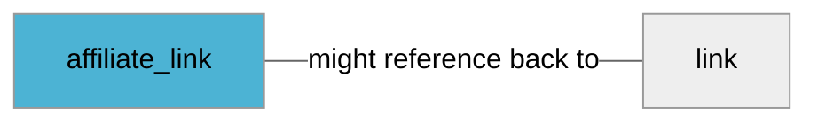

import Tabs from '@theme/Tabs';
import TabItem from '@theme/TabItem';
import Anchor from "@site/src/components/anchor"
import Field from '@site/docs/partials/_field.mdx';
import ReactMarkdown from 'react-markdown';
import ChangeLog from '@site/src/components/changelog';
import OptionalField from '@site/docs/partials/_optional_field.md';

# affiliate_link

<OptionalField/>

## Description

Add this attribute if you're using affiliate platform tracking.


### Effects When Used

- Affiliate tracking is enabled


## Related Fields




## Validation Rules

- Must be valid [RFC 3986](https://www.rfc-editor.org/rfc/rfc3986) uri
- Must have a protocol (eg. `https`)
- Must have a path (eg. `.../my-product`)
- Must be shorter than `2047` characters
- Unicode characters must be [url encoded](/advanced/url-encode)


## Example Values

Here are examples of how a valid *affiliate_link* value  should look like in XML and CSV (with header) respectively.

<Tabs>
  <TabItem value="valid_xml" label="XML" default>

:::tip Valid Value

```xml
<pj:affiliate_link>http://example.com/link</pj:affiliate_link>
```

:::

<details>
  <summary>Click to show more valid XML examples</summary>
  <div>

```xml
<pj:affiliate_link>http://example.com/link</pj:affiliate_link>
```

```xml
<pj:affiliate_link>https://example.com/link</pj:affiliate_link>
```

```xml
<pj:affiliate_link>https://example.com/link(black)_(large)</pj:affiliate_link>
```

```xml
<pj:affiliate_link>https://example.com/link#foo</pj:affiliate_link>
```

```xml
<pj:affiliate_link><![CDATA[https://example.com/link?utm_source=1&utm_medium=2]]></pj:affiliate_link>
```

```xml
<pj:affiliate_link>http://example.com/link-%E2%84%A2-mu-20%C2%B5m</pj:affiliate_link>
```

```xml
<pj:affiliate_link></pj:affiliate_link>
```


  </div>
</details>

 </TabItem>
  <TabItem value="valid_csv" label="CSV">

:::tip Valid Value

```csv
affiliate_link
http://example.com/link
```

:::

<details>
  <summary>Click to show more valid CSV examples</summary>
  <div>

```csv
affiliate_link
http://example.com/link
```

```csv
affiliate_link
https://example.com/link
```

```csv
affiliate_link
https://example.com/link(black)_(large)
```

```csv
affiliate_link
https://example.com/link#foo
```

```csv
affiliate_link
https://example.com/link?utm_source=1&utm_medium=2
```

```csv
affiliate_link
http://example.com/link-%E2%84%A2-mu-20%C2%B5m
```

```csv
affiliate_link
""
```


  </div>
</details>

  </TabItem>
</Tabs>

## Error Codes

Below you will find possible error codes generated when validating this field alongside with an example in XML and CSV that would trigger the code. Please refer to the [validation rules](#validation-rules) to understand the cause.

<Tabs>
  <TabItem value="invalid_xml" label="XML" default>

:::danger[**<Anchor id="validation_invalid_length" title="validation_invalid_length" />**]


```xml
<pj:affiliate_link>https://example.com/aaaaaaaaaaaaaaaaaaaaaaaaaaaaaaaaaaaaaaaaaaaaaaaaaaaaaaaaaaaaaaaaaaaaaaaaaaaaaaaaaaaaaaaaaaaaaaaaaaaaaaaaaaaaaaaaaaaaaaaaaaaaaaaaaaaaaaaaaaaaaaaaaaaaaaaaaaaaaaaaaaaaaaaaaaaaaaaaaaaaaaaaaaaaaaaaaaaaaaaaaaaaaaaaaaaaaaaaaaaaaaaaaaaaaaaaaaaaaaaaaaaaaaaaaaaaaaaaaaaaaaaaaaaaaaaaaaaaaaaaaaaaaaaaaaaaaaaaaaaaaaaaaaaaaaaaaaaaaaaaaaaaaaaaaaaaaaaaaaaaaaaaaaaaaaaaaaaaaaaaaaaaaaaaaaaaaaaaaaaaaaaaaaaaaaaaaaaaaaaaaaaaaaaaaaaaaaaaaaaaaaaaaaaaaaaaaaaaaaaaaaaaaaaaaaaaaaaaaaaaaaaaaaaaaaaaaaaaaaaaaaaaaaaaaaaaaaaaaaaaaaaaaaaaaaaaaaaaaaaaaaaaaaaaaaaaaaaaaaaaaaaaaaaaaaaaaaaaaaaaaaaaaaaaaaaaaaaaaaaaaaaaaaaaaaaaaaaaaaaaaaaaaaaaaaaaaaaaaaaaaaaaaaaaaaaaaaaaaaaaaaaaaaaaaaaaaaaaaaaaaaaaaaaaaaaaaaaaaaaaaaaaaaaaaaaaaaaaaaaaaaaaaaaaaaaaaaaaaaaaaaaaaaaaaaaaaaaaaaaaaaaaaaaaaaaaaaaaaaaaaaaaaaaaaaaaaaaaaaaaaaaaaaaaaaaaaaaaaaaaaaaaaaaaaaaaaaaaaaaaaaaaaaaaaaaaaaaaaaaaaaaaaaaaaaaaaaaaaaaaaaaaaaaaaaaaaaaaaaaaaaaaaaaaaaaaaaaaaaaaaaaaaaaaaaaaaaaaaaaaaaaaaaaaaaaaaaaaaaaaaaaaaaaaaaaaaaaaaaaaaaaaaaaaaaaaaaaaaaaaaaaaaaaaaaaaaaaaaaaaaaaaaaaaaaaaaaaaaaaaaaaaaaaaaaaaaaaaaaaaaaaaaaaaaaaaaaaaaaaaaaaaaaaaaaaaaaaaaaaaaaaaaaaaaaaaaaaaaaaaaaaaaaaaaaaaaaaaaaaaaaaaaaaaaaaaaaaaaaaaaaaaaaaaaaaaaaaaaaaaaaaaaaaaaaaaaaaaaaaaaaaaaaaaaaaaaaaaaaaaaaaaaaaaaaaaaaaaaaaaaaaaaaaaaaaaaaaaaaaaaaaaaaaaaaaaaaaaaaaaaaaaaaaaaaaaaaaaaaaaaaaaaaaaaaaaaaaaaaaaaaaaaaaaaaaaaaaaaaaaaaaaaaaaaaaaaaaaaaaaaaaaaaaaaaaaaaaaaaaaaaaaaaaaaaaaaaaaaaaaaaaaaaaaaaaaaaaaaaaaaaaaaaaaaaaaaaaaaaaaaaaaaaaaaaaaaaaaaaaaaaaaaaaaaaaaaaaaaaaaaaaaaaaaaaaaaaaaaaaaaaaaaaaaaaaaaaaaaaaaaaaaaaaaaaaaaaaaaaaaaaaaaaaaaaaaaaaaaaaaaaaaaaaaaaaaaaaaaaaaaaaaaaaaaaaaaaaaaaaaaaaaaaaaaaaaaaaaaaaaaaaaaaaaaaaaaaaaaaaaaaaaaaaaaaaaaaaaaaaaaaaaaaaaaaaaaaaaaaaaaaaaaaaaaaaaaaaaaaaaaaaaaaaaaaaaaaaaaaaaaaaaaaaaaaaaaaaaaaaaaaaaaaaaaaaaaaaaaaaaaaaaaaaaaaaaaaaaaaaaaaaaaaaaaaaaaaaaaaaaaaaaaaaaaaaaaaaaaaaaaaaaaaaaaaaaaaaaaaaaaaaaaaaaaaaaaaaaaaaaaaaaaaaaaaaaaaaaaaaaaaaaaaaaaaaaaaaaaaaaaaaaaaaaaaaaaaaaaaaaaaaaaaaaaaaaaaaaaaaaaaaaaaaaaaaaaaaaaaaaaaaaaaaaaaaaaaaaaaaaaaaaaaaaaaaaaaaaaaaaaaaaaaaaaaaaaaaaaaaaaaaaaaaaaaaaaaaaaaaaaaaaaaaaaaaaaaaaaaaaaaaaaaaa (more than 2047 characters value)</pj:affiliate_link>
```

:::

:::danger[**<Anchor id="validation_invalid_url" title="validation_invalid_url" />**]


```xml
<pj:affiliate_link>http://bar</pj:affiliate_link>
```

:::

:::danger[**<Anchor id="validation_invalid_url_fragment" title="validation_invalid_url_fragment" />**]


```xml
<pj:affiliate_link>https://example.com/link##</pj:affiliate_link>
```

:::

:::danger[**<Anchor id="validation_invalid_url_host" title="validation_invalid_url_host" />**]


```xml
<pj:affiliate_link>http://example%.com/link</pj:affiliate_link>
```

:::

:::danger[**<Anchor id="validation_invalid_url_path" title="validation_invalid_url_path" />**]


```xml
<pj:affiliate_link>https://example.com/link[12-34]</pj:affiliate_link>
```

:::

:::danger[**<Anchor id="validation_invalid_url_port" title="validation_invalid_url_port" />**]


```xml
<pj:affiliate_link>http://example.com:foo/link</pj:affiliate_link>
```

:::

:::danger[**<Anchor id="validation_invalid_url_query" title="validation_invalid_url_query" />**]


```xml
<pj:affiliate_link>https://example.com/link?param=value^up-arrow</pj:affiliate_link>
```

:::

:::danger[**<Anchor id="validation_url_scheme_not_allowed" title="validation_url_scheme_not_allowed" />**]


```xml
<pj:affiliate_link>foo://example.com/link</pj:affiliate_link>
```
```xml
<pj:affiliate_link>ftp://example.com/link</pj:affiliate_link>
```
```xml
<pj:affiliate_link>ftps://example.com/link</pj:affiliate_link>
```
```xml
<pj:affiliate_link>sftp://example.com/link</pj:affiliate_link>
```

:::


 </TabItem>
  <TabItem value="invalid_csv" label="CSV">

:::danger <Anchor id="validation_invalid_length" title="validation_invalid_length" />

```csv
affiliate_link
https://example.com/aaaaaaaaaaaaaaaaaaaaaaaaaaaaaaaaaaaaaaaaaaaaaaaaaaaaaaaaaaaaaaaaaaaaaaaaaaaaaaaaaaaaaaaaaaaaaaaaaaaaaaaaaaaaaaaaaaaaaaaaaaaaaaaaaaaaaaaaaaaaaaaaaaaaaaaaaaaaaaaaaaaaaaaaaaaaaaaaaaaaaaaaaaaaaaaaaaaaaaaaaaaaaaaaaaaaaaaaaaaaaaaaaaaaaaaaaaaaaaaaaaaaaaaaaaaaaaaaaaaaaaaaaaaaaaaaaaaaaaaaaaaaaaaaaaaaaaaaaaaaaaaaaaaaaaaaaaaaaaaaaaaaaaaaaaaaaaaaaaaaaaaaaaaaaaaaaaaaaaaaaaaaaaaaaaaaaaaaaaaaaaaaaaaaaaaaaaaaaaaaaaaaaaaaaaaaaaaaaaaaaaaaaaaaaaaaaaaaaaaaaaaaaaaaaaaaaaaaaaaaaaaaaaaaaaaaaaaaaaaaaaaaaaaaaaaaaaaaaaaaaaaaaaaaaaaaaaaaaaaaaaaaaaaaaaaaaaaaaaaaaaaaaaaaaaaaaaaaaaaaaaaaaaaaaaaaaaaaaaaaaaaaaaaaaaaaaaaaaaaaaaaaaaaaaaaaaaaaaaaaaaaaaaaaaaaaaaaaaaaaaaaaaaaaaaaaaaaaaaaaaaaaaaaaaaaaaaaaaaaaaaaaaaaaaaaaaaaaaaaaaaaaaaaaaaaaaaaaaaaaaaaaaaaaaaaaaaaaaaaaaaaaaaaaaaaaaaaaaaaaaaaaaaaaaaaaaaaaaaaaaaaaaaaaaaaaaaaaaaaaaaaaaaaaaaaaaaaaaaaaaaaaaaaaaaaaaaaaaaaaaaaaaaaaaaaaaaaaaaaaaaaaaaaaaaaaaaaaaaaaaaaaaaaaaaaaaaaaaaaaaaaaaaaaaaaaaaaaaaaaaaaaaaaaaaaaaaaaaaaaaaaaaaaaaaaaaaaaaaaaaaaaaaaaaaaaaaaaaaaaaaaaaaaaaaaaaaaaaaaaaaaaaaaaaaaaaaaaaaaaaaaaaaaaaaaaaaaaaaaaaaaaaaaaaaaaaaaaaaaaaaaaaaaaaaaaaaaaaaaaaaaaaaaaaaaaaaaaaaaaaaaaaaaaaaaaaaaaaaaaaaaaaaaaaaaaaaaaaaaaaaaaaaaaaaaaaaaaaaaaaaaaaaaaaaaaaaaaaaaaaaaaaaaaaaaaaaaaaaaaaaaaaaaaaaaaaaaaaaaaaaaaaaaaaaaaaaaaaaaaaaaaaaaaaaaaaaaaaaaaaaaaaaaaaaaaaaaaaaaaaaaaaaaaaaaaaaaaaaaaaaaaaaaaaaaaaaaaaaaaaaaaaaaaaaaaaaaaaaaaaaaaaaaaaaaaaaaaaaaaaaaaaaaaaaaaaaaaaaaaaaaaaaaaaaaaaaaaaaaaaaaaaaaaaaaaaaaaaaaaaaaaaaaaaaaaaaaaaaaaaaaaaaaaaaaaaaaaaaaaaaaaaaaaaaaaaaaaaaaaaaaaaaaaaaaaaaaaaaaaaaaaaaaaaaaaaaaaaaaaaaaaaaaaaaaaaaaaaaaaaaaaaaaaaaaaaaaaaaaaaaaaaaaaaaaaaaaaaaaaaaaaaaaaaaaaaaaaaaaaaaaaaaaaaaaaaaaaaaaaaaaaaaaaaaaaaaaaaaaaaaaaaaaaaaaaaaaaaaaaaaaaaaaaaaaaaaaaaaaaaaaaaaaaaaaaaaaaaaaaaaaaaaaaaaaaaaaaaaaaaaaaaaaaaaaaaaaaaaaaaaaaaaaaaaaaaaaaaaaaaaaaaaaaaaaaaaaaaaaaaaaaaaaaaaaaaaaaaaaaaaaaaaaaaaaaaaaaaaaaaaaaaaaaaaaaaaaaaaaaaaaaaaaaaaaaaaaaaaaaaaaaaaaaaaaaaaaaaaaaaaaaaaaaaaaaaaaaaaaaaaaaaaaaaaaaaaaaaaaaaaaaaaaaaaaaaaaaaaaaaaaaaaaaaaaaaaaaaaaaaaaaaaaaaaaaaaaaaaaaaaaaaaaaaaaaaaaaaaaaaaaaaaaaaaaaaaaaaaaaaaaaaaaaaaaaaaaaaaaaaaaaaaaa (more than 2047 characters value)
```

:::

:::danger <Anchor id="validation_invalid_url" title="validation_invalid_url" />

```csv
affiliate_link
http://bar
```

:::

:::danger <Anchor id="validation_invalid_url_fragment" title="validation_invalid_url_fragment" />

```csv
affiliate_link
https://example.com/link##
```

:::

:::danger <Anchor id="validation_invalid_url_host" title="validation_invalid_url_host" />

```csv
affiliate_link
http://example%.com/link
```

:::

:::danger <Anchor id="validation_invalid_url_path" title="validation_invalid_url_path" />

```csv
affiliate_link
https://example.com/link[12-34]
```

:::

:::danger <Anchor id="validation_invalid_url_port" title="validation_invalid_url_port" />

```csv
affiliate_link
http://example.com:foo/link
```

:::

:::danger <Anchor id="validation_invalid_url_query" title="validation_invalid_url_query" />

```csv
affiliate_link
https://example.com/link?param=value^up-arrow
```

:::

:::danger <Anchor id="validation_url_scheme_not_allowed" title="validation_url_scheme_not_allowed" />

```csv
affiliate_link
foo://example.com/link
```
```csv
affiliate_link
ftp://example.com/link
```
```csv
affiliate_link
ftps://example.com/link
```
```csv
affiliate_link
sftp://example.com/link
```

:::


  </TabItem>
</Tabs>

## Properties

|     **Property** |         **Value**          | **Description**                                              |
|-----------------:|:--------------------------:|:-------------------------------------------------------------|
|        Data Type |    **Url**     | Closest data type in code                                    |
|           Nested |      **False**      | Defines if this field consists of one or more sub-fields     |
|   Case Sensitive |  **True**  | If small or large letters matter for this field              |
|       Repeatable |    **False**    | If you can supply multiple items of this field (it´s a list) |
| Repeatable limit | **0** | If a list, this specifices the max number of items           |

## Changelog
<ChangeLog versionHistory={[{"added": ["Initial definition"], "date": "2022-12-07"}]} dateOnly={true} />

