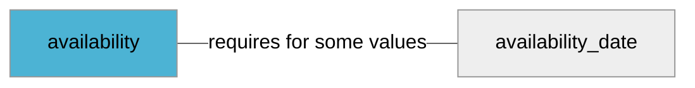

import Tabs from '@theme/Tabs';
import TabItem from '@theme/TabItem';
import Anchor from "@site/src/components/anchor"
import Field from '@site/docs/partials/_field.mdx';
import ReactMarkdown from 'react-markdown';
import ChangeLog from '@site/src/components/changelog';
import RequiredField from '@site/docs/partials/_required_field.md';

# availability

<RequiredField/>

## Description

Use the availability attribute to display your stock status.


### Effects When Used

- Enables us to indicate if a customer can order the product


## Related Fields




## Allowed Enum Values

<dl>
<dt>
      <pre>
      <code>
      download
      </code>
      </pre>
    </dt>
    <dd>
    <ReactMarkdown>
      {`When the product is made digitally available, eg. game or software downloads`}
    </ReactMarkdown>
    </dd>
<dt>
      <pre>
      <code>
      in_stock
      </code>
      </pre>
    </dt>
    <dd>
    <ReactMarkdown>
      {`You're currently accepting orders for this product and can fulfill the purchase request directly.`}
    </ReactMarkdown>
    </dd>
<dt>
      <pre>
      <code>
      out_of_stock
      </code>
      </pre>
    </dt>
    <dd>
    <ReactMarkdown>
      {`You're not currently accepting orders for this product.`}
    </ReactMarkdown>
    </dd>
<dt>
      <pre>
      <code>
      preorder
      </code>
      </pre>
    </dt>
    <dd>
    <ReactMarkdown>
      {`You're currently taking orders for this product, but it's not yet been released for sale. You're required to provide the availability date [availability_date](/feeds/offer/fields/availability_date) attribute to indicate the day that the product becomes available for delivery.`}
    </ReactMarkdown>
    </dd>
<dt>
      <pre>
      <code>
      backorder
      </code>
      </pre>
    </dt>
    <dd>
    <ReactMarkdown>
      {`The product is not available at the moment, but you're accepting orders and it'll be shipped as soon as it becomes available again. This status can be combined with the availability date [availability_date](/feeds/offer/fields/availability_date) attribute to indicate the day that the product becomes available for delivery.`}
    </ReactMarkdown>
    </dd>
</dl>


## Validation Rules

- Value must be one of the allowed enum values


## Best Practices


### Do

- Use up-to-date stock info


### Don´t

- Don't use out of stock when the shop is temporarily down
- Don't use out of stock when you want to remove the product from the listing
- Don't use out of stock for products that are discontinued


## Example Values

Here are examples of how a valid *availability* value  should look like in XML and CSV (with header) respectively.

<Tabs>
  <TabItem value="valid_xml" label="XML" default>

:::tip Valid Value

```xml
<g:availability>download</g:availability>
```

:::

<details>
  <summary>Click to show more valid XML examples</summary>
  <div>

```xml
<g:availability>download</g:availability>
```

```xml
<g:availability>in_stock</g:availability>
```

```xml
<g:availability>out_of_stock</g:availability>
```

```xml
<g:availability>preorder</g:availability>
<g:availability_date>2021-03-21</g:availability_date>
```

```xml
<g:availability>backorder</g:availability>
<g:availability_date>2021-03-21</g:availability_date>
```


  </div>
</details>

 </TabItem>
  <TabItem value="valid_csv" label="CSV">

:::tip Valid Value

```csv
availability
download
```

:::

<details>
  <summary>Click to show more valid CSV examples</summary>
  <div>

```csv
availability
download
```

```csv
availability
in_stock
```

```csv
availability
out_of_stock
```

```csv
availability,availability_date
preorder,2021-03-21
```

```csv
availability,availability_date
backorder,2021-03-21
```


  </div>
</details>

  </TabItem>
</Tabs>

## Error Codes

Below you will find possible error codes generated when validating this field alongside with an example in XML and CSV that would trigger the code. Please refer to the [validation rules](#validation-rules) to understand the cause.

<Tabs>
  <TabItem value="invalid_xml" label="XML" default>

:::danger[**<Anchor id="validation_invalid_enum" title="validation_invalid_enum" />**]


```xml
<g:availability>unknown</g:availability>
```

:::

:::danger[**<Anchor id="validation_missing_value" title="validation_missing_value" />**]


```xml
<g:availability></g:availability>
```

:::


 </TabItem>
  <TabItem value="invalid_csv" label="CSV">

:::danger <Anchor id="validation_invalid_enum" title="validation_invalid_enum" />

```csv
availability
unknown
```

:::

:::danger <Anchor id="validation_missing_value" title="validation_missing_value" />

```csv
availability
""
```

:::


  </TabItem>
</Tabs>

## Properties

|     **Property** |         **Value**          | **Description**                                              |
|-----------------:|:--------------------------:|:-------------------------------------------------------------|
|        Data Type |    **enum**     | Closest data type in code                                    |
|           Nested |      **False**      | Defines if this field consists of one or more sub-fields     |
|   Case Sensitive |  **False**  | If small or large letters matter for this field              |
|       Repeatable |    **False**    | If you can supply multiple items of this field (it´s a list) |
| Repeatable limit | **0** | If a list, this specifices the max number of items           |

## Changelog
<ChangeLog versionHistory={[{"date": "2024-05-14", "removed": ["Enum value `not_available_for_purchase` is no longer supported. Please use `out_of_stock` instead."]}, {"date": "2023-09-14", "deprecated": ["Enum value `backorder` does not require [`availability_date`](/feeds/offer/fields/availability_date.md) to be set anymore."]}, {"date": "2023-03-20", "deprecated": ["Enum value `download` is now deprecated and should not be used anymore. Download is a delivery option and should be specified using the [`shipping`](/feeds/offer/fields/shipping.md) field."]}, {"date": "2023-03-17", "deprecated": ["Enum value `pickup` has been removed and should not be used anymore. Using `pickup` value would result in validation error. Pickup is a delivery option and should be specified using the [`shipping`](/feeds/offer/fields/shipping.md) field."]}, {"changed": ["Offers with value `out_of_stock` are no longer orderable. See deprecation notice below."], "date": "2023-03-13", "deprecated": ["Value `not_available_for_purchase` should no longer be used, please use `out_of_stock` instead"]}, {"date": "2023-01-05", "deprecated": ["Enum value `pickup` is now deprecated and should not be used anymore. Pickup is a delivery option and should be specified using the [`shipping`](/feeds/offer/fields/shipping.md) field."]}, {"date": "2022-12-20", "deprecated": ["Previously `out_of_stock` values were still orderable, from now on `out_of_stock` will not be orderable. If you want to represent a product that is not in stock but still orderable you should use `backorder` and set [`availability_date`](/feeds/offer/fields/availability_date.md)"]}, {"added": ["New enum value `backorder`, this value should be used for products that are orderable but currently not in stock."], "date": "2022-12-08"}, {"added": ["Initial definition"], "date": "2022-12-07"}]} dateOnly={true} />

## References
- [Google Merchant Specification](https://support.google.com/merchants/answer/6324448)
