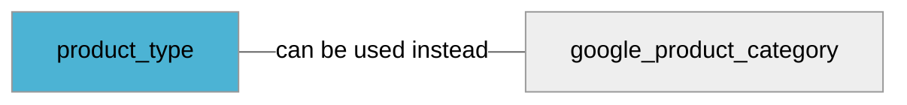

import Tabs from '@theme/Tabs';
import TabItem from '@theme/TabItem';
import Anchor from "@site/src/components/anchor"
import Field from '@site/docs/partials/_field.mdx';
import ReactMarkdown from 'react-markdown';
import ChangeLog from '@site/src/components/changelog';
import OptionalField from '@site/docs/partials/_optional_field.md';

# product_type

<OptionalField/>

## Description

It's strongly recommended to use this attribute if [`google_product_category`](/feeds/offer/fields/google_product_category.md) is not present.


### Effects When Used

- This field is used for product categorization.


## Related Fields




## Validation Rules

- Length must be between `1-750` characters


## Best Practices


### Do

- Include the complete category hierarchy, such as `Home & Garden > Furniture > Living Room`.
- To list multiple product_type entries, separate them with a comma. For instance: `Home & Garden > Furniture > Living Room, Home & Garden > Popular Living Room Furniture`.


### Don´t

- Refrain from including categories such as "Apple," "Sale," or "Black Friday 2023."
- If using a CSV file, do not use comma `,` within a single product_type entry. They will split the entry. For instance, `Home, Garden > Furniture > Living Room` will become two separate entries: `Home` and `Garden > Furniture > Living Room`.
- When using XML, always use a distinct &lt;product_type&gt; tag for each category instead of combining them within one tag.


## Example Values

Here are examples of how a valid *product_type* value  should look like in XML and CSV (with header) respectively.

<Tabs>
  <TabItem value="valid_xml" label="XML" default>

:::tip Valid Value

```xml
<g:product_type><![CDATA[Sporting Goods > Athletics > Figure Skating & Hockey > Ice Skates]]></g:product_type>
```

:::

<details>
  <summary>Click to show more valid XML examples</summary>
  <div>

```xml
<g:product_type><![CDATA[Sporting Goods > Athletics > Figure Skating & Hockey > Ice Skates]]></g:product_type>
```

```xml
<g:product_type><![CDATA[type 1]]></g:product_type>
<g:product_type><![CDATA[type 2]]></g:product_type>
```

```xml
<g:product_type><![CDATA[computer_accessories]]></g:product_type>
```


  </div>
</details>

 </TabItem>
  <TabItem value="valid_csv" label="CSV">

:::tip Valid Value

```csv
product_type
Sporting Goods > Athletics > Figure Skating & Hockey > Ice Skates
```

:::

<details>
  <summary>Click to show more valid CSV examples</summary>
  <div>

```csv
product_type
Sporting Goods > Athletics > Figure Skating & Hockey > Ice Skates
```

```csv
product_type
"type 1,type 2"
```

```csv
product_type
computer_accessories
```


  </div>
</details>

  </TabItem>
</Tabs>

## Error Codes

Below you will find possible error codes generated when validating this field alongside with an example in XML and CSV that would trigger the code. Please refer to the [validation rules](#validation-rules) to understand the cause.

<Tabs>
  <TabItem value="invalid_xml" label="XML" default>

:::danger[**<Anchor id="validation_invalid_length" title="validation_invalid_length" />**]


```xml
<g:product_type><![CDATA[aaaaaaaaaaaaaaaaaaaaaaaaaaaaaaaaaaaaaaaaaaaaaaaaaaaaaaaaaaaaaaaaaaaaaaaaaaaaaaaaaaaaaaaaaaaaaaaaaaaaaaaaaaaaaaaaaaaaaaaaaaaaaaaaaaaaaaaaaaaaaaaaaaaaaaaaaaaaaaaaaaaaaaaaaaaaaaaaaaaaaaaaaaaaaaaaaaaaaaaaaaaaaaaaaaaaaaaaaaaaaaaaaaaaaaaaaaaaaaaaaaaaaaaaaaaaaaaaaaaaaaaaaaaaaaaaaaaaaaaaaaaaaaaaaaaaaaaaaaaaaaaaaaaaaaaaaaaaaaaaaaaaaaaaaaaaaaaaaaaaaaaaaaaaaaaaaaaaaaaaaaaaaaaaaaaaaaaaaaaaaaaaaaaaaaaaaaaaaaaaaaaaaaaaaaaaaaaaaaaaaaaaaaaaaaaaaaaaaaaaaaaaaaaaaaaaaaaaaaaaaaaaaaaaaaaaaaaaaaaaaaaaaaaaaaaaaaaaaaaaaaaaaaaaaaaaaaaaaaaaaaaaaaaaaaaaaaaaaaaaaaaaaaaaaaaaaaaaaaaaaaaaaaaaaaaaaaaaaaaaaaaaaaaaaaaaaaaaaaaaaaaaaaaaaaaaaaaaaaaaaaaaaaaaaaaaaaaaaaaaaaaaaaaaaaaaaaaaaaaaaaaaaaaaaaaaaaaaaaaaaaaaaaaaaaaaaaaaaaaaaaaaaaaaaaaaaaaaaaaaaaaaaaaaaaaaaaaaaaaaaaaaaaaaaaaa (more than 751 characters value)]]></g:product_type>
```

:::


 </TabItem>
  <TabItem value="invalid_csv" label="CSV">

:::danger <Anchor id="validation_invalid_length" title="validation_invalid_length" />

```csv
product_type
aaaaaaaaaaaaaaaaaaaaaaaaaaaaaaaaaaaaaaaaaaaaaaaaaaaaaaaaaaaaaaaaaaaaaaaaaaaaaaaaaaaaaaaaaaaaaaaaaaaaaaaaaaaaaaaaaaaaaaaaaaaaaaaaaaaaaaaaaaaaaaaaaaaaaaaaaaaaaaaaaaaaaaaaaaaaaaaaaaaaaaaaaaaaaaaaaaaaaaaaaaaaaaaaaaaaaaaaaaaaaaaaaaaaaaaaaaaaaaaaaaaaaaaaaaaaaaaaaaaaaaaaaaaaaaaaaaaaaaaaaaaaaaaaaaaaaaaaaaaaaaaaaaaaaaaaaaaaaaaaaaaaaaaaaaaaaaaaaaaaaaaaaaaaaaaaaaaaaaaaaaaaaaaaaaaaaaaaaaaaaaaaaaaaaaaaaaaaaaaaaaaaaaaaaaaaaaaaaaaaaaaaaaaaaaaaaaaaaaaaaaaaaaaaaaaaaaaaaaaaaaaaaaaaaaaaaaaaaaaaaaaaaaaaaaaaaaaaaaaaaaaaaaaaaaaaaaaaaaaaaaaaaaaaaaaaaaaaaaaaaaaaaaaaaaaaaaaaaaaaaaaaaaaaaaaaaaaaaaaaaaaaaaaaaaaaaaaaaaaaaaaaaaaaaaaaaaaaaaaaaaaaaaaaaaaaaaaaaaaaaaaaaaaaaaaaaaaaaaaaaaaaaaaaaaaaaaaaaaaaaaaaaaaaaaaaaaaaaaaaaaaaaaaaaaaaaaaaaaaaaaaaaaaaaaaaaaaaaaaaaaaaaaaaaaaa (more than 751 characters value)
```

:::


  </TabItem>
</Tabs>

## Properties

|     **Property** |         **Value**          | **Description**                                              |
|-----------------:|:--------------------------:|:-------------------------------------------------------------|
|        Data Type |    **string**     | Closest data type in code                                    |
|           Nested |      **False**      | Defines if this field consists of one or more sub-fields     |
|   Case Sensitive |  **False**  | If small or large letters matter for this field              |
|       Repeatable |    **True**    | If you can supply multiple items of this field (it´s a list) |
| Repeatable limit | **100** | If a list, this specifices the max number of items           |

## Changelog
<ChangeLog versionHistory={[{"added": ["Change length limit for product_type to 750 characters"], "date": "2023-08-21"}, {"added": ["Remove requirement on [`product_type`](/feeds/offer/fields/product_type.md) if [`google_product_category`](/feeds/offer/fields/google_product_category.md) is not present"], "date": "2023-02-07"}, {"added": ["Initial definition"], "date": "2022-12-07"}]} dateOnly={true} />

## References
- [Google Merchant Specification](https://support.google.com/merchants/answer/6324406)
