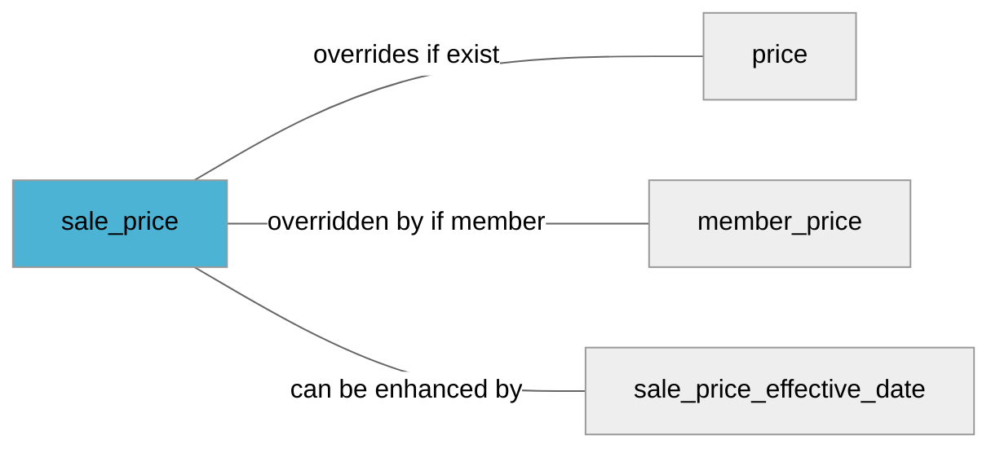

import Tabs from '@theme/Tabs';
import TabItem from '@theme/TabItem';
import Anchor from "@site/src/components/anchor"
import Field from '@site/docs/partials/_field.mdx';
import ReactMarkdown from 'react-markdown';
import ChangeLog from '@site/src/components/changelog';
import OptionalField from '@site/docs/partials/_optional_field.md';

# sale_price

<OptionalField/>

## Description

It should be the same as the currently active sales price on your product page. If the sales is inactive it should be empty or [`sale_price_effective_date`](sale_price_effective_date.md) attribute should be used.


## Related Fields




## Validation Rules

- Must be a number (value) followed by a space and a currency (unit)
- Number *may* have **two decimals**, separated by a `.` (dot)
- Currency must be three upper case characters and a valid [ISO 4217](https://en.wikipedia.org/wiki/ISO_4217) currency
- Zero prices are **not** allowed
- Must be lower than [`price`](/feeds/offer/fields/price.md)


## Best Practices


### Do

- Price sent in feed should be the same as the price value on your product page
- Currency sent in feed should match currency on your product page


### Don´t

- Do **not** include extra charges in the cost (such as shipping cost)
- Do **not** use thousand separators or similar in the value (while we may handle some of these cases we recommend you to just send plain numbers like `10000.50 SEK`)


## Example Values

Here are examples of how a valid *sale_price* value  should look like in XML and CSV (with header) respectively.

<Tabs>
  <TabItem value="valid_xml" label="XML" default>

:::tip Valid Value

```xml
<g:sale_price>99.99 SEK</g:sale_price>
<g:price>3200000 SEK</g:price>
```

:::

<details>
  <summary>Click to show more valid XML examples</summary>
  <div>

```xml
<g:sale_price>99.99 SEK</g:sale_price>
<g:price>3200000 SEK</g:price>
```

```xml
<g:sale_price>100 SEK</g:sale_price>
<g:price>3200000 SEK</g:price>
```

```xml
<g:sale_price>SEK 100</g:sale_price>
<g:price>3200000 SEK</g:price>
```

```xml
<g:sale_price>99,99 SEK</g:sale_price>
<g:price>3200000 SEK</g:price>
```

```xml
<g:sale_price>10,000.00 SEK</g:sale_price>
<g:price>3200000 SEK</g:price>
```

```xml
<g:sale_price>10 000.00 SEK</g:sale_price>
<g:price>3200000 SEK</g:price>
```

```xml
<g:sale_price>10.000 SEK</g:sale_price>
<g:price>3200000 SEK</g:price>
```

```xml
<g:sale_price>1.144.000 SEK</g:sale_price>
<g:price>3200000 SEK</g:price>
```


  </div>
</details>

 </TabItem>
  <TabItem value="valid_csv" label="CSV">

:::tip Valid Value

```csv
sale_price,price
99.99 SEK,3200000 SEK
```

:::

<details>
  <summary>Click to show more valid CSV examples</summary>
  <div>

```csv
sale_price,price
99.99 SEK,3200000 SEK
```

```csv
sale_price,price
100 SEK,3200000 SEK
```

```csv
sale_price,price
SEK 100,3200000 SEK
```

```csv
sale_price,price
"99,99 SEK",3200000 SEK
```

```csv
sale_price,price
"10,000.00 SEK",3200000 SEK
```

```csv
sale_price,price
10 000.00 SEK,3200000 SEK
```

```csv
sale_price,price
10.000 SEK,3200000 SEK
```

```csv
sale_price,price
1.144.000 SEK,3200000 SEK
```


  </div>
</details>

  </TabItem>
</Tabs>

## Error Codes

Below you will find possible error codes generated when validating this field alongside with an example in XML and CSV that would trigger the code. Please refer to the [validation rules](#validation-rules) to understand the cause.

<Tabs>
  <TabItem value="invalid_xml" label="XML" default>

:::danger[**<Anchor id="validation_missing_currency" title="validation_missing_currency" />**]


```xml
<g:sale_price>100$</g:sale_price>
<g:price>3200000 SEK</g:price>
```

:::

:::danger[**<Anchor id="validation_missing_price_value" title="validation_missing_price_value" />**]


```xml
<g:sale_price>SEK</g:sale_price>
<g:price>3200000 SEK</g:price>
```

:::

:::danger[**<Anchor id="validation_not_number" title="validation_not_number" />**]


```xml
<g:sale_price>10.0.00.00 SEK</g:sale_price>
<g:price>3200000 SEK</g:price>
```
```xml
<g:sale_price>10.0.00.00 SEK</g:sale_price>
<g:price>3200000 SEK</g:price>
```
```xml
<g:sale_price>foo SEK</g:sale_price>
<g:price>3200000 SEK</g:price>
```

:::

:::danger[**<Anchor id="validation_not_positive_number" title="validation_not_positive_number" />**]


```xml
<g:sale_price>-10 SEK</g:sale_price>
<g:price>3200000 SEK</g:price>
```
```xml
<g:sale_price>0 SEK</g:sale_price>
<g:price>3200000 SEK</g:price>
```

:::

:::danger[**<Anchor id="validation_sale_price_is_not_lower_then_price" title="validation_sale_price_is_not_lower_then_price" />**]


```xml
<g:sale_price>100 SEK</g:sale_price>
<g:price>100 SEK</g:price>
```
```xml
<g:sale_price>100 SEK</g:sale_price>
<g:price>50 SEK</g:price>
```

:::

:::danger[**<Anchor id="validation_unknown_currency" title="validation_unknown_currency" />**]


```xml
<g:sale_price>$100</g:sale_price>
<g:price>3200000 SEK</g:price>
```

:::


 </TabItem>
  <TabItem value="invalid_csv" label="CSV">

:::danger <Anchor id="validation_missing_currency" title="validation_missing_currency" />

```csv
sale_price,price
100$,3200000 SEK
```

:::

:::danger <Anchor id="validation_missing_price_value" title="validation_missing_price_value" />

```csv
sale_price,price
SEK,3200000 SEK
```

:::

:::danger <Anchor id="validation_not_number" title="validation_not_number" />

```csv
sale_price,price
10.0.00.00 SEK,3200000 SEK
```
```csv
sale_price,price
10.0.00.00 SEK,3200000 SEK
```
```csv
sale_price,price
foo SEK,3200000 SEK
```

:::

:::danger <Anchor id="validation_not_positive_number" title="validation_not_positive_number" />

```csv
sale_price,price
-10 SEK,3200000 SEK
```
```csv
sale_price,price
0 SEK,3200000 SEK
```

:::

:::danger <Anchor id="validation_sale_price_is_not_lower_then_price" title="validation_sale_price_is_not_lower_then_price" />

```csv
sale_price,price
100 SEK,100 SEK
```
```csv
sale_price,price
100 SEK,50 SEK
```

:::

:::danger <Anchor id="validation_unknown_currency" title="validation_unknown_currency" />

```csv
sale_price,price
$100,3200000 SEK
```

:::


  </TabItem>
</Tabs>

## Properties

|     **Property** |         **Value**          | **Description**                                              |
|-----------------:|:--------------------------:|:-------------------------------------------------------------|
|        Data Type |    **price**     | Closest data type in code                                    |
|           Nested |      **False**      | Defines if this field consists of one or more sub-fields     |
|   Case Sensitive |  **False**  | If small or large letters matter for this field              |
|       Repeatable |    **False**    | If you can supply multiple items of this field (it´s a list) |
| Repeatable limit | **0** | If a list, this specifices the max number of items           |

## Changelog
<ChangeLog versionHistory={[{"added": ["Initial definition"], "date": "2022-12-07"}]} dateOnly={true} />

## References
- [Google Merchant Specification](https://support.google.com/merchants/answer/6324471)
- [Wikipedia on ISO 4217 Currency codes](https://en.wikipedia.org/wiki/ISO_4217)
