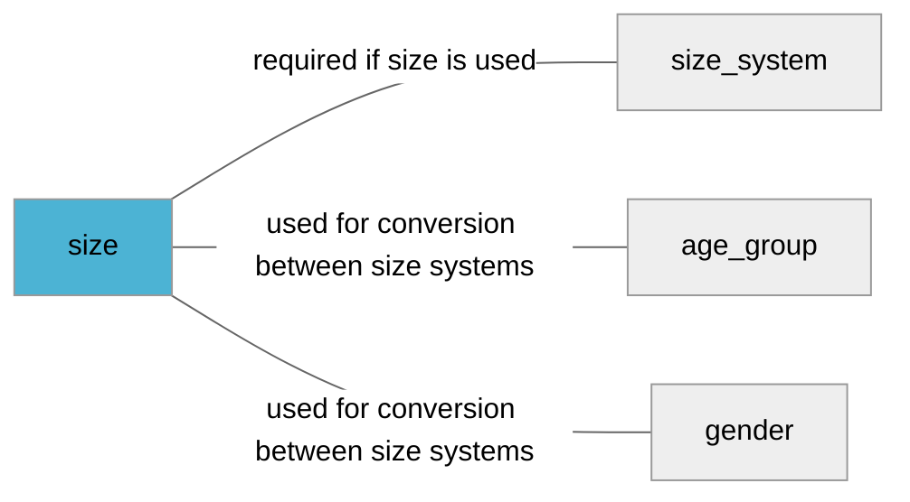

import Tabs from '@theme/Tabs';
import TabItem from '@theme/TabItem';
import Anchor from "@site/src/components/anchor"
import Field from '@site/docs/partials/_field.mdx';
import ReactMarkdown from 'react-markdown';
import ChangeLog from '@site/src/components/changelog';
import OptionalField from '@site/docs/partials/_optional_field.md';

# size

<OptionalField/>

## Description

Used to describe size in **fashion categories**. It is recommended to add this attribute for fashion products to improve results and listing.


### Effects When Used

- This attribute allows user to filter offers with specific size


## Related Fields




## Validation Rules

- Length must be between `1-100` characters


## Best Practices


### Do

- Use standard values


## Example Values

Here are examples of how a valid *size* value  should look like in XML and CSV (with header) respectively.

<Tabs>
  <TabItem value="valid_xml" label="XML" default>

:::tip Valid Value

```xml
<g:size>XS</g:size>
```

:::

<details>
  <summary>Click to show more valid XML examples</summary>
  <div>

```xml
<g:size>XS</g:size>
```

```xml
<g:size>XXXL</g:size>
```


  </div>
</details>

 </TabItem>
  <TabItem value="valid_csv" label="CSV">

:::tip Valid Value

```csv
size
XS
```

:::

<details>
  <summary>Click to show more valid CSV examples</summary>
  <div>

```csv
size
XS
```

```csv
size
XXXL
```


  </div>
</details>

  </TabItem>
</Tabs>

## Error Codes

Below you will find possible error codes generated when validating this field alongside with an example in XML and CSV that would trigger the code. Please refer to the [validation rules](#validation-rules) to understand the cause.

<Tabs>
  <TabItem value="invalid_xml" label="XML" default>

:::danger[**<Anchor id="validation_invalid_length" title="validation_invalid_length" />**]


```xml
<g:size>aaaaaaaaaaaaaaaaaaaaaaaaaaaaaaaaaaaaaaaaaaaaaaaaaaaaaaaaaaaaaaaaaaaaaaaaaaaaaaaaaaaaaaaaaaaaaaaaaaaaa (more than 100 characters value)</g:size>
```

:::


 </TabItem>
  <TabItem value="invalid_csv" label="CSV">

:::danger <Anchor id="validation_invalid_length" title="validation_invalid_length" />

```csv
size
aaaaaaaaaaaaaaaaaaaaaaaaaaaaaaaaaaaaaaaaaaaaaaaaaaaaaaaaaaaaaaaaaaaaaaaaaaaaaaaaaaaaaaaaaaaaaaaaaaaaa (more than 100 characters value)
```

:::


  </TabItem>
</Tabs>

## Properties

|     **Property** |         **Value**          | **Description**                                              |
|-----------------:|:--------------------------:|:-------------------------------------------------------------|
|        Data Type |    **string**     | Closest data type in code                                    |
|           Nested |      **False**      | Defines if this field consists of one or more sub-fields     |
|   Case Sensitive |  **False**  | If small or large letters matter for this field              |
|       Repeatable |    **False**    | If you can supply multiple items of this field (it´s a list) |
| Repeatable limit | **0** | If a list, this specifices the max number of items           |

## Changelog
<ChangeLog versionHistory={[{"added": ["Initial definition"], "date": "2022-12-07"}]} dateOnly={true} />

## References
- [Google Merchant Specification](https://support.google.com/merchants/answer/6324492)
