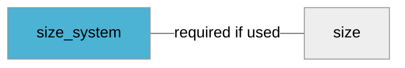

import Tabs from '@theme/Tabs';
import TabItem from '@theme/TabItem';
import Anchor from "@site/src/components/anchor"
import Field from '@site/docs/partials/_field.mdx';
import ReactMarkdown from 'react-markdown';
import ChangeLog from '@site/src/components/changelog';
import OptionalField from '@site/docs/partials/_optional_field.md';

# size_system

<OptionalField/>

## Description

Using this attribute is required if [`size`](size.md) is specified for a product.


## Related Fields




## Allowed Enum Values

<dl>
<dt>
      <pre>
      <code>
      au
      </code>
      </pre>
    </dt>
    <dd>
    </dd>
<dt>
      <pre>
      <code>
      br
      </code>
      </pre>
    </dt>
    <dd>
    </dd>
<dt>
      <pre>
      <code>
      cn
      </code>
      </pre>
    </dt>
    <dd>
    </dd>
<dt>
      <pre>
      <code>
      de
      </code>
      </pre>
    </dt>
    <dd>
    </dd>
<dt>
      <pre>
      <code>
      eu
      </code>
      </pre>
    </dt>
    <dd>
    </dd>
<dt>
      <pre>
      <code>
      fr
      </code>
      </pre>
    </dt>
    <dd>
    </dd>
<dt>
      <pre>
      <code>
      it
      </code>
      </pre>
    </dt>
    <dd>
    </dd>
<dt>
      <pre>
      <code>
      jp
      </code>
      </pre>
    </dt>
    <dd>
    </dd>
<dt>
      <pre>
      <code>
      mex
      </code>
      </pre>
    </dt>
    <dd>
    </dd>
<dt>
      <pre>
      <code>
      uk
      </code>
      </pre>
    </dt>
    <dd>
    </dd>
<dt>
      <pre>
      <code>
      us
      </code>
      </pre>
    </dt>
    <dd>
    </dd>
</dl>


## Validation Rules

- Must be one of the allowed enum values


## Best Practices


### Do

- Use accepted size systems
- Do not create own size systems


## Example Values

Here are examples of how a valid *size_system* value  should look like in XML and CSV (with header) respectively.

<Tabs>
  <TabItem value="valid_xml" label="XML" default>

:::tip Valid Value

```xml
<g:size_system>au</g:size_system>
<g:size>XS</g:size>
```

:::

<details>
  <summary>Click to show more valid XML examples</summary>
  <div>

```xml
<g:size_system>au</g:size_system>
<g:size>XS</g:size>
```

```xml
<g:size_system>br</g:size_system>
<g:size>XS</g:size>
```

```xml
<g:size_system>cn</g:size_system>
<g:size>XS</g:size>
```

```xml
<g:size_system>de</g:size_system>
<g:size>XS</g:size>
```

```xml
<g:size_system>eu</g:size_system>
<g:size>XS</g:size>
```

```xml
<g:size_system>fr</g:size_system>
<g:size>XS</g:size>
```

```xml
<g:size_system>it</g:size_system>
<g:size>XS</g:size>
```

```xml
<g:size_system>jp</g:size_system>
<g:size>XS</g:size>
```

```xml
<g:size_system>mex</g:size_system>
<g:size>XS</g:size>
```

```xml
<g:size_system>uk</g:size_system>
<g:size>XS</g:size>
```

```xml
<g:size_system>us</g:size_system>
<g:size>XS</g:size>
```

```xml
<g:size_system>eu</g:size_system>
<g:size>XS</g:size>
```


  </div>
</details>

 </TabItem>
  <TabItem value="valid_csv" label="CSV">

:::tip Valid Value

```csv
size_system,size
au,XS
```

:::

<details>
  <summary>Click to show more valid CSV examples</summary>
  <div>

```csv
size_system,size
au,XS
```

```csv
size_system,size
br,XS
```

```csv
size_system,size
cn,XS
```

```csv
size_system,size
de,XS
```

```csv
size_system,size
eu,XS
```

```csv
size_system,size
fr,XS
```

```csv
size_system,size
it,XS
```

```csv
size_system,size
jp,XS
```

```csv
size_system,size
mex,XS
```

```csv
size_system,size
uk,XS
```

```csv
size_system,size
us,XS
```

```csv
size_system,size
eu,XS
```


  </div>
</details>

  </TabItem>
</Tabs>

## Error Codes

Below you will find possible error codes generated when validating this field alongside with an example in XML and CSV that would trigger the code. Please refer to the [validation rules](#validation-rules) to understand the cause.

<Tabs>
  <TabItem value="invalid_xml" label="XML" default>

:::danger[**<Anchor id="validation_invalid_enum" title="validation_invalid_enum" />**]


```xml
<g:size_system>unknown</g:size_system>
<g:size>XS</g:size>
```

:::

:::danger[**<Anchor id="validation_size_system_without_size" title="validation_size_system_without_size" />**]


```xml
<g:size_system>uk</g:size_system>
```

:::


 </TabItem>
  <TabItem value="invalid_csv" label="CSV">

:::danger <Anchor id="validation_invalid_enum" title="validation_invalid_enum" />

```csv
size_system,size
unknown,XS
```

:::

:::danger <Anchor id="validation_size_system_without_size" title="validation_size_system_without_size" />

```csv
size_system
uk
```

:::


  </TabItem>
</Tabs>

## Properties

|     **Property** |         **Value**          | **Description**                                              |
|-----------------:|:--------------------------:|:-------------------------------------------------------------|
|        Data Type |    **string**     | Closest data type in code                                    |
|           Nested |      **False**      | Defines if this field consists of one or more sub-fields     |
|   Case Sensitive |  **False**  | If small or large letters matter for this field              |
|       Repeatable |    **False**    | If you can supply multiple items of this field (it´s a list) |
| Repeatable limit | **0** | If a list, this specifices the max number of items           |

## Changelog
<ChangeLog versionHistory={[{"added": ["Initial definition"], "date": "2022-12-07"}]} dateOnly={true} />

## References
- [Google Merchant Specification](https://support.google.com/merchants/answer/6324502)
