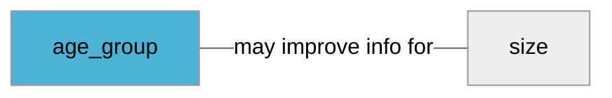

import Tabs from '@theme/Tabs';
import TabItem from '@theme/TabItem';
import Anchor from "@site/src/components/anchor"
import Field from '@site/docs/partials/_field.mdx';
import ReactMarkdown from 'react-markdown';
import ChangeLog from '@site/src/components/changelog';
import OptionalField from '@site/docs/partials/_optional_field.md';

# age_group

<OptionalField/>

## Description

Sets the demographic age your product is designed for.


## Related Fields




## Allowed Enum Values

<dl>
<dt>
      <pre>
      <code>
      adult
      </code>
      </pre>
    </dt>
    <dd>
    </dd>
<dt>
      <pre>
      <code>
      infant
      </code>
      </pre>
    </dt>
    <dd>
    </dd>
<dt>
      <pre>
      <code>
      kids
      </code>
      </pre>
    </dt>
    <dd>
    </dd>
<dt>
      <pre>
      <code>
      newborn
      </code>
      </pre>
    </dt>
    <dd>
    </dd>
<dt>
      <pre>
      <code>
      toddler
      </code>
      </pre>
    </dt>
    <dd>
    </dd>
</dl>


## Validation Rules

- Value must be one of the allowed enum values


## Best Practices


### Do

- It is recommended to add this attribute for fashion products to improve results and listing
- Use to indicate demographic, not an [`adult`](/fields/adult.md) audience


## Example Values

Here are examples of how a valid *age_group* value  should look like in XML and CSV (with header) respectively.

<Tabs>
  <TabItem value="valid_xml" label="XML" default>

:::tip Valid Value

```xml
<g:age_group>adult</g:age_group>
```

:::

<details>
  <summary>Click to show more valid XML examples</summary>
  <div>

```xml
<g:age_group>adult</g:age_group>
```

```xml
<g:age_group>infant</g:age_group>
```

```xml
<g:age_group>kids</g:age_group>
```

```xml
<g:age_group>newborn</g:age_group>
```

```xml
<g:age_group>toddler</g:age_group>
```


  </div>
</details>

 </TabItem>
  <TabItem value="valid_csv" label="CSV">

:::tip Valid Value

```csv
age_group
adult
```

:::

<details>
  <summary>Click to show more valid CSV examples</summary>
  <div>

```csv
age_group
adult
```

```csv
age_group
infant
```

```csv
age_group
kids
```

```csv
age_group
newborn
```

```csv
age_group
toddler
```


  </div>
</details>

  </TabItem>
</Tabs>

## Error Codes

Below you will find possible error codes generated when validating this field alongside with an example in XML and CSV that would trigger the code. Please refer to the [validation rules](#validation-rules) to understand the cause.

<Tabs>
  <TabItem value="invalid_xml" label="XML" default>

:::danger <Anchor id="validation_invalid_enum" title="validation_invalid_enum" />

```xml
<g:age_group>unknown</g:age_group>
```

:::


 </TabItem>
  <TabItem value="invalid_csv" label="CSV">

:::danger <Anchor id="validation_invalid_enum" title="validation_invalid_enum" />

```csv
age_group
unknown
```

:::


  </TabItem>
</Tabs>

## Properties

|     **Property** |         **Value**          | **Description**                                              |
|-----------------:|:--------------------------:|:-------------------------------------------------------------|
|        Data Type |    **string**     | Closest data type in code                                    |
|           Nested |      **False**      | Defines if this field consists of one or more sub-fields     |
|   Case Sensitive |  **False**  | If small or large letters matter for this field              |
|       Repeatable |    **False**    | If you can supply multiple items of this field (it´s a list) |
| Repeatable limit | **0** | If a list, this specifices the max number of items           |

## Changelog
<ChangeLog versionHistory={[{"added": ["Initial definition"], "date": "2022-12-07"}]} dateOnly={true} />

## References
- [Google Merchant Specification](https://support.google.com/merchants/answer/6324463)
