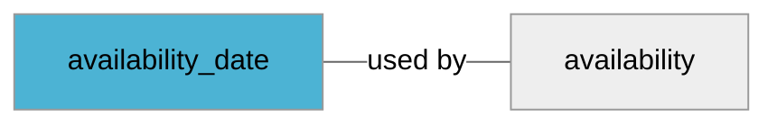

import Tabs from '@theme/Tabs';
import TabItem from '@theme/TabItem';
import Anchor from "@site/src/components/anchor"
import Field from '@site/docs/partials/_field.mdx';
import ReactMarkdown from 'react-markdown';
import ChangeLog from '@site/src/components/changelog';
import OptionalField from '@site/docs/partials/_optional_field.md';

# availability_date

<OptionalField/>

## Description

This field is used together with [`availability`](/fields/availability.md) for `preorder` or `backorder` values.


### Effects When Used

- We will display a label alongside with availability indicator that says when the product is available


### Effects When Omitted

- No information is available for customer regarding when a `preorder` or `backorder` offer is available


## Related Fields




## Validation Rules

- Value must parse as valid ISO 8601, see examples


## Best Practices


### Do

- Include the time portion of the date (if missing 12:00 AM CET will be set)


## Example Values

Here are examples of how a valid *availability_date* value  should look like in XML and CSV (with header) respectively.

<Tabs>
  <TabItem value="valid_xml" label="XML" default>

:::tip Valid Value

```xml
<g:availability_date>2021-12-22T03:12:58.019077+00:00</g:availability_date>
<g:availability>preorder</g:availability>
```

:::

<details>
  <summary>Click to show more valid XML examples</summary>
  <div>

```xml
<g:availability_date>2021-12-22T03:12:58.019077+00:00</g:availability_date>
<g:availability>preorder</g:availability>
```

```xml
<g:availability_date>2021-03-21</g:availability_date>
<g:availability>preorder</g:availability>
```


  </div>
</details>

 </TabItem>
  <TabItem value="valid_csv" label="CSV">

:::tip Valid Value

```csv
availability_date,availability
2021-12-22T03:12:58.019077+00:00,preorder
```

:::

<details>
  <summary>Click to show more valid CSV examples</summary>
  <div>

```csv
availability_date,availability
2021-12-22T03:12:58.019077+00:00,preorder
```

```csv
availability_date,availability
2021-03-21,preorder
```


  </div>
</details>

  </TabItem>
</Tabs>

## Error Codes

Below you will find possible error codes generated when validating this field alongside with an example in XML and CSV that would trigger the code. Please refer to the [validation rules](#validation-rules) to understand the cause.

<Tabs>
  <TabItem value="invalid_xml" label="XML" default>

:::danger <Anchor id="validation_invalid_format" title="validation_invalid_format" /> 

```xml
<g:availability_date>2021/12/22/12:23:00</g:availability_date>
```

:::

:::danger <Anchor id="validation_invalid_value" title="validation_invalid_value" /> 

```xml
<g:availability_date>2021-03-21</g:availability_date>
<g:availability>in_stock</g:availability>
```

:::

:::danger <Anchor id="validation_missing_field" title="validation_missing_field" /> 

```xml
<g:availability>preorder</g:availability>
```

:::


 </TabItem>
  <TabItem value="invalid_csv" label="CSV">

:::danger <Anchor id="validation_invalid_format" title="validation_invalid_format" /> 

```csv
availability_date
2021/12/22/12:23:00
```

:::

:::danger <Anchor id="validation_invalid_value" title="validation_invalid_value" /> 

```csv
availability_date,availability
2021-03-21,in_stock
```

:::

:::danger <Anchor id="validation_missing_field" title="validation_missing_field" /> 

```csv
availability_date,availability
,preorder
```

:::


  </TabItem>
</Tabs>

## Properties

|     **Property** |         **Value**          | **Description**                                              |
|-----------------:|:--------------------------:|:-------------------------------------------------------------|
|        Data Type |    **date**     | Closest data type in code                                    |
|           Nested |      **False**      | Defines if this field consists of one or more sub-fields     |
|   Case Sensitive |  **False**  | If small or large letters matter for this field              |
|       Repeatable |    **False**    | If you can supply multiple items of this field (it´s a list) |
| Repeatable limit | **0** | If a list, this specifices the max number of items           |

## Changelog
<ChangeLog versionHistory={[{"added": ["Initial definition"], "date": "2022-12-07"}]} dateOnly={true} />

## References
- [Google Merchant Specification](https://support.google.com/merchants/answer/6324470)
- [Wikipedia on ISO 8601](https://en.wikipedia.org/wiki/ISO_8601)
