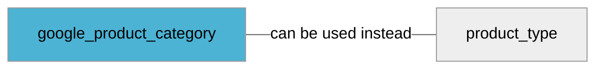

import Tabs from '@theme/Tabs';
import TabItem from '@theme/TabItem';
import Anchor from "@site/src/components/anchor"
import Field from '@site/docs/partials/_field.mdx';
import ReactMarkdown from 'react-markdown';
import ChangeLog from '@site/src/components/changelog';
import OptionalField from '@site/docs/partials/_optional_field.md';

# google_product_category

<OptionalField/>

## Description

This attribute is used to help us place products in relevant categories. It should contain full category path from Google Taxonomy or respective category id. If you don't know or have Google product category, submit [`product_type`](/fields/product_type) instead.


### Effects When Used

- This information helps us to make the products discoverable and searchable for the users


## Related Fields




## Validation Rules

- If id is used it must match an existing Google Product Category id (see references below)
- If category path is used, it must match Google Product Category path exactly (see references below)
- Use only one attribute of this type per product


## Best Practices


### Do

- Prefer using id's instead of strings if possible
- Use the most nested category possible
- Avoid using root categories
- Use full category path or respective category id from the list (see references)
- Wrap in a CDATA element if using xml


## Example Values

Here are examples of how a valid *google_product_category* value  should look like in XML and CSV (with header) respectively.

<Tabs>
  <TabItem value="valid_xml" label="XML" default>

:::tip Valid Value

```xml
<g:google_product_category>1144</g:google_product_category>
```

:::

<details>
  <summary>Click to show more valid XML examples</summary>
  <div>

```xml
<g:google_product_category>1144</g:google_product_category>
```

```xml
<g:google_product_category>1</g:google_product_category>
```

```xml
<g:google_product_category>1157</g:google_product_category>
```

```xml
<g:google_product_category><![CDATA[Animals & Pet Supplies > Pet Supplies > Reptile & Amphibian Supplies]]></g:google_product_category>
```

```xml
<g:google_product_category><![CDATA[Dyr og tilbehør til kæledyr > Tilbehør til kæledyr > Tilbehør til hunde]]></g:google_product_category>
```

```xml
<g:google_product_category><![CDATA[Sporting Goods > Athletics > Figure Skating & Hockey > Ice Skates]]></g:google_product_category>
```


  </div>
</details>

 </TabItem>
  <TabItem value="valid_csv" label="CSV">

:::tip Valid Value

```csv
google_product_category
1144
```

:::

<details>
  <summary>Click to show more valid CSV examples</summary>
  <div>

```csv
google_product_category
1144
```

```csv
google_product_category
1
```

```csv
google_product_category
1157
```

```csv
google_product_category
Animals & Pet Supplies > Pet Supplies > Reptile & Amphibian Supplies
```

```csv
google_product_category
Dyr og tilbehør til kæledyr > Tilbehør til kæledyr > Tilbehør til hunde
```

```csv
google_product_category
Sporting Goods > Athletics > Figure Skating & Hockey > Ice Skates
```


  </div>
</details>

  </TabItem>
</Tabs>

## Error Codes

Below you will find possible error codes generated when validating this field alongside with an example in XML and CSV that would trigger the code. Please refer to the [validation rules](#validation-rules) to understand the cause.

<Tabs>
  <TabItem value="invalid_xml" label="XML" default>

:::danger <Anchor id="validation_category_not_found" title="validation_category_not_found" />

```xml
<g:google_product_category>144</g:google_product_category>
```

:::

:::danger <Anchor id="validation_invalid_length" title="validation_invalid_length" />

```xml
<g:google_product_category>aaaaaaaaaaaaaaaaaaaaaaaaaaaaaaaaaaaaaaaaaaaaaaaaaaaaaaaaaaaaaaaaaaaaaaaaaaaaaaaaaaaaaaaaaaaaaaaaaaaaaaaaaaaaaaaaaaaaaaaaaaaaaaaaaaaaaaaaaaaaaaaaaaaaaaaaaaaaaaaaaaaaaaaaaaaaaaaaaaaaaaaaaaaaaaaaaaaaaaaaaaaaaaaaaaaaaaaaaaaaaaaaaaaaaaaaaaaaaaaaaaaaaaaaaaaaaaaaaaaaaaaaaaaaaaaaaaaaaaaaaaaaaaaaaaaaaaaaaaaaaaaaaaaaaaaaaaaaaaaaaaaaaaaaaaaaaaaaaaaaaaaaaaaaaaaaaaaaaaaaaaaaaaaaaaaaaaaaaaaaaaaaaaaaaaaaaaaaaaaaaaaaaaaaaaaaaaaaaaaaaaaaaaaaaaaaaaaaaaaaaaaaaaaaaaaaaaaaaaaaaaaaaaaaaaaaaaaaaaaaaaaaaaaaaaaaaaaaaaaaaaaaaaaaaaaaaaaaaaaaaaaaaaaaaaaaaaaaaaaaaaaaaaaaaaaaaaaaaaaaaaaaaaaaaaaaaaaaaaaaaaaaaaaaaaaaaaaaaaaaaaaaaaaaaaaaaaaaaaaaaaaaaaaaaaaaaaaaaaaaaaaaaaaaaaaaaaaaaaaaaaaaaaaaaaaaaaaaaaaaaaaaaaaaaaaaaaaaaaaaaaaaaaaaaaaaaaaaaaaaaaaaaaaaaaaaaaaaaaaaaaaaaaaaaaaaaaaaaaaaaaaaaaaaaaaaaaaaaaaaaaaaaaaaaaaaaaaaaaaaaaaaaaaaaaaaaaaaaaaaaaaaaaaaaaaaaaaaaaaaaaaaaaaaaaaaaaaaaaaaaaaaaaaaaaaaaaaaaaaaaaaaaaaaaaaaaaaaaaaaaaaaaaaaaaaaaaaaaaaaaaaaaaaaaaaaaaaaaaaaaaaaaaaaaaaaaaaaaaaaaaaaaaaaaaaaaaaaaaaaaaaaaaaaaaaaaaaaaaaaa (more than 1000 characters value)</g:google_product_category>
```

:::


 </TabItem>
  <TabItem value="invalid_csv" label="CSV">

:::danger <Anchor id="validation_category_not_found" title="validation_category_not_found" />

```csv
google_product_category
144
```

:::

:::danger <Anchor id="validation_invalid_length" title="validation_invalid_length" />

```csv
google_product_category
aaaaaaaaaaaaaaaaaaaaaaaaaaaaaaaaaaaaaaaaaaaaaaaaaaaaaaaaaaaaaaaaaaaaaaaaaaaaaaaaaaaaaaaaaaaaaaaaaaaaaaaaaaaaaaaaaaaaaaaaaaaaaaaaaaaaaaaaaaaaaaaaaaaaaaaaaaaaaaaaaaaaaaaaaaaaaaaaaaaaaaaaaaaaaaaaaaaaaaaaaaaaaaaaaaaaaaaaaaaaaaaaaaaaaaaaaaaaaaaaaaaaaaaaaaaaaaaaaaaaaaaaaaaaaaaaaaaaaaaaaaaaaaaaaaaaaaaaaaaaaaaaaaaaaaaaaaaaaaaaaaaaaaaaaaaaaaaaaaaaaaaaaaaaaaaaaaaaaaaaaaaaaaaaaaaaaaaaaaaaaaaaaaaaaaaaaaaaaaaaaaaaaaaaaaaaaaaaaaaaaaaaaaaaaaaaaaaaaaaaaaaaaaaaaaaaaaaaaaaaaaaaaaaaaaaaaaaaaaaaaaaaaaaaaaaaaaaaaaaaaaaaaaaaaaaaaaaaaaaaaaaaaaaaaaaaaaaaaaaaaaaaaaaaaaaaaaaaaaaaaaaaaaaaaaaaaaaaaaaaaaaaaaaaaaaaaaaaaaaaaaaaaaaaaaaaaaaaaaaaaaaaaaaaaaaaaaaaaaaaaaaaaaaaaaaaaaaaaaaaaaaaaaaaaaaaaaaaaaaaaaaaaaaaaaaaaaaaaaaaaaaaaaaaaaaaaaaaaaaaaaaaaaaaaaaaaaaaaaaaaaaaaaaaaaaaaaaaaaaaaaaaaaaaaaaaaaaaaaaaaaaaaaaaaaaaaaaaaaaaaaaaaaaaaaaaaaaaaaaaaaaaaaaaaaaaaaaaaaaaaaaaaaaaaaaaaaaaaaaaaaaaaaaaaaaaaaaaaaaaaaaaaaaaaaaaaaaaaaaaaaaaaaaaaaaaaaaaaaaaaaaaaaaaaaaaaaaaaaaaaaaaaaaaaaaaaaaaaaaaaaaaaaaaaaaaaaaaaaaaaaaaaaaaaaaaaaaaaaaaa (more than 1000 characters value)
```

:::


  </TabItem>
</Tabs>

## Properties

|     **Property** |         **Value**          | **Description**                                              |
|-----------------:|:--------------------------:|:-------------------------------------------------------------|
|        Data Type |    **string**     | Closest data type in code                                    |
|           Nested |      **False**      | Defines if this field consists of one or more sub-fields     |
|   Case Sensitive |  **False**  | If small or large letters matter for this field              |
|       Repeatable |    **False**    | If you can supply multiple items of this field (it´s a list) |
| Repeatable limit | **0** | If a list, this specifices the max number of items           |

## Changelog
<ChangeLog versionHistory={[{"added": ["Remove requirement on [`google_product_category`](/fields/google_product_category) if [`product_type`](/fields/product_type) is not present"], "date": "2023-02-07"}, {"added": ["Initial definition"], "date": "2022-12-07"}]} dateOnly={true} />

## References
- [Google Merchant Specification](https://support.google.com/merchants/answer/6324436)
- [Google Taxonomy With Ids (en-US)](https://www.google.com/basepages/producttype/taxonomy-with-ids.en-US.txt)
- [Google Taxonomy With Ids (sv-SE)](https://www.google.com/basepages/producttype/taxonomy-with-ids.sv-SE.txt)
- [Google Taxonomy With Ids (no-NO)](https://www.google.com/basepages/producttype/taxonomy-with-ids.no-NO.txt)
