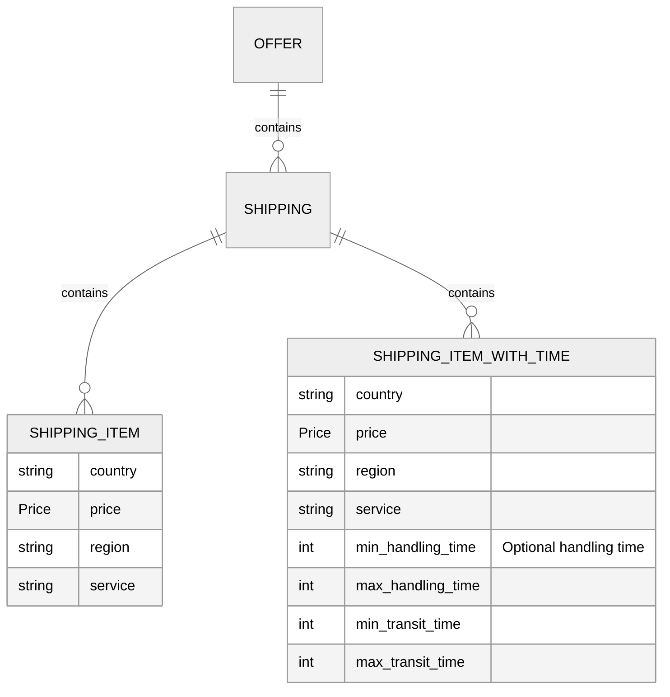

# shipping

:::info Optional Field

This field is optional, but omitting it may leave out functionality on Prisjakt for your offers

:::




## Description

This attribute is *optional*.
Please note, that `shipping` is **required** for all products sold on French market. The `shipping` attribute is used to specify the cost of shipping of a product.

## Requirements

* *optional*


## Specification Details

- It's highly recommended as an offer, as without shipping it's less attractive for the user
- It is also recommended to include this cost to improve conversion
- Keep shipping information as precise as possible. Add multiple shipping attributes if shipping cost or time varies for different country, region or service.
- Don't provide comma or point as separator for both thousands and fractional part of the shipping price, i.e. we don't support `1,000,00 SEK` and `1.000.00 SEK` formats

## Allowed Values
- Submit complete shipping information
- Handling time and transit time should be specified in days.
- Overestimate if you can't provide accurate shipping cost
- Submit shipping cost including VAT, use local currency
- If you provide information about handling or transit time then min_handling_time should be lesser or equal to max_handling_time and min_transit_time should be lesser or equal to max_transit_time

## Format

- Type: List[Nested]
- Encoding: UTF-8
- Repeatable: yes, up to 100
- Subattributes:
   - country (**required**) - String, ISO 3166 alpha-2 code   - price (**required**) - Price, Number, currency (ISO 4217) and decimal point   - max_handling_time (optional) - Integer   - max_transit_time (optional) - Integer   - min_handling_time (optional) - Integer   - min_transit_time (optional) - Integer   - region (optional) - String, up to 50 characters   - service (optional) - String, up to 50 characters

## Validation Error Codes

### validation_null_value

## Valid XML Examples

<table>
<thead>
<tr><th>Valid example                                                                                                                                                                                                                                                                                                                         </th></tr>
</thead>
<tbody>
<tr><td>

```xml
<g:shipping>
  <g:country>SE</g:country>
  <g:price>5 SEK</g:price>
  <g:region>New York</g:region>
  <g:service>DHL</g:service>
</g:shipping>                                                                                                                                                                                        
```

</td></tr>
<tr><td>

```xml
<g:shipping>
  <g:country>SE</g:country>
  <g:price>0 GBP</g:price>
  <g:region>London</g:region>
  <g:service>DHL</g:service>
</g:shipping>                                                                                                                                                                                          
```

</td></tr>
<tr><td>

```xml
<g:shipping>
  <g:country>SE</g:country>
  <g:max_handling_time>5</g:max_handling_time>
  <g:max_transit_time>3</g:max_transit_time>
  <g:min_handling_time>1</g:min_handling_time>
  <g:min_transit_time>1</g:min_transit_time>
  <g:price>5.00 SEK</g:price>
  <g:region>Skåne</g:region>
  <g:service>DHL</g:service>
</g:shipping>
```

</td></tr>
</tbody>
</table>

## Valid CSV Examples

<table>
<thead>
<tr><th>Valid example                                                                                                                             </th></tr>
</thead>
<tbody>
<tr><td>

```csv
shipping(country:region:service:price)
SE:New York:DHL:5 SEK                                                                              
```

</td></tr>
<tr><td>

```csv
shipping(country:region:service:price)
SE:London:DHL:0 GBP                                                                                
```

</td></tr>
<tr><td>

```csv
shipping(country:region:service:price:min_handling_time:max_handling_time:min_transit_time:max_transit_time)
SE:Skåne:DHL:5.00 SEK:1:5:1:3
```

</td></tr>
</tbody>
</table>

## Invalid XML Examples

<table>
<thead>
<tr><th>Invalid example                                                                                                                                                                             </th><th>Resulting error code  </th></tr>
</thead>
<tbody>
<tr><td>

```xml
<g:shipping>
  <g:country></g:country>
  <g:min_handling_time>-1</g:min_handling_time>
  <g:price>5 SEK</g:price>
  <g:region>New York</g:region>
  <g:service>DHL</g:service>
</g:shipping>
```

</td><td>

```xml
validation_null_value 
```

</td></tr>
<tr><td>

```xml
<g:shipping>
  <g:country>SE</g:country>
  <g:min_handling_time>-1</g:min_handling_time>
  <g:price></g:price>
  <g:region>New York</g:region>
  <g:service>DHL</g:service>
</g:shipping>   
```

</td><td>

```xml
validation_null_value 
```

</td></tr>
</tbody>
</table>

## Invalid CSV Examples

<table>
<thead>
<tr><th>Invalid example                                                                </th><th>Resulting error code  </th></tr>
</thead>
<tbody>
<tr><td>

```csv
shipping(country:region:service:price:min_handling_time)
:New York:DHL:5 SEK:-1
```

</td><td>

```csv
validation_null_value 
```

</td></tr>
<tr><td>

```csv
shipping(country:region:service:price:min_handling_time)
SE:New York:DHL::-1   
```

</td><td>

```csv
validation_null_value 
```

</td></tr>
</tbody>
</table>

## References
* https://support.google.com/merchants/answer/6324484
