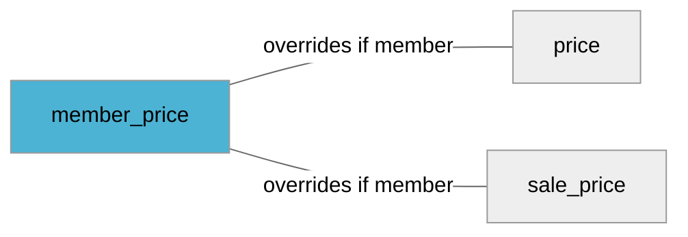

import Tabs from '@theme/Tabs';
import TabItem from '@theme/TabItem';
import Anchor from "@site/src/components/anchor"
import Field from '@site/docs/partials/_field.mdx';
import ReactMarkdown from 'react-markdown';
import ChangeLog from '@site/src/components/changelog';
import OptionalField from '@site/docs/partials/_optional_field.md';

# member_price

<OptionalField/>

## Description

This is product price that is active for users with active membership


## Related Fields




## Validation Rules

- Must be a number (value) followed by a space and a currency (unit)
- Number *may* have **two decimals**, separated by a `.` (dot)
- Currency must be three upper case characters and a valid [ISO 4217](https://en.wikipedia.org/wiki/ISO_4217) currency
- Zero prices are **not** allowed


## Best Practices


### Do

- Price sent in feed should be the same as the price value on your product page
- Currency sent in feed should match currency on your product page


### Don´t

- Do **not** include extra charges in the cost (such as shipping cost)
- Do **not** use thousand separators or similar in the value (while we may handle some of these cases we recommend you to just send plain numbers like `10000.50 SEK`)


## Example Values

Here are examples of how a valid *member_price* value  should look like in XML and CSV (with header) respectively.

<Tabs>
  <TabItem value="valid_xml" label="XML" default>

:::tip Valid Value

```xml
<pj:member_price>99.99 SEK</pj:member_price>
```

:::

<details>
  <summary>Click to show more valid XML examples</summary>
  <div>

```xml
<pj:member_price>99.99 SEK</pj:member_price>
```

```xml
<pj:member_price>100 SEK</pj:member_price>
```

```xml
<pj:member_price>SEK 100</pj:member_price>
```

```xml
<pj:member_price>99,99 SEK</pj:member_price>
```

```xml
<pj:member_price>10,000.00 SEK</pj:member_price>
```

```xml
<pj:member_price>10 000.00 SEK</pj:member_price>
```

```xml
<pj:member_price>10.000 SEK</pj:member_price>
```

```xml
<pj:member_price>1.144.000 SEK</pj:member_price>
```


  </div>
</details>

 </TabItem>
  <TabItem value="valid_csv" label="CSV">

:::tip Valid Value

```csv
member_price
99.99 SEK
```

:::

<details>
  <summary>Click to show more valid CSV examples</summary>
  <div>

```csv
member_price
99.99 SEK
```

```csv
member_price
100 SEK
```

```csv
member_price
SEK 100
```

```csv
member_price
"99,99 SEK"
```

```csv
member_price
"10,000.00 SEK"
```

```csv
member_price
10 000.00 SEK
```

```csv
member_price
10.000 SEK
```

```csv
member_price
1.144.000 SEK
```


  </div>
</details>

  </TabItem>
</Tabs>

## Error Codes

Below you will find possible error codes generated when validating this field alongside with an example in XML and CSV that would trigger the code. Please refer to the [validation rules](#validation-rules) to understand the cause.

<Tabs>
  <TabItem value="invalid_xml" label="XML" default>

:::danger <Anchor id="validation_missing_currency" title="validation_missing_currency" /> 

```xml
<pj:member_price>1000</pj:member_price>
```

:::

:::danger <Anchor id="validation_missing_price_value" title="validation_missing_price_value" /> 

```xml
<pj:member_price>foo SEK</pj:member_price>
```

:::

:::danger <Anchor id="validation_not_number" title="validation_not_number" /> 

```xml
<pj:member_price>10.0.00.00 SEK</pj:member_price>
```

:::

:::danger <Anchor id="validation_not_positive_number" title="validation_not_positive_number" /> 

```xml
<pj:member_price>-10 SEK</pj:member_price>
```

:::

:::danger <Anchor id="validation_unknown_currency" title="validation_unknown_currency" /> 

```xml
<pj:member_price>$100</pj:member_price>
```

:::


 </TabItem>
  <TabItem value="invalid_csv" label="CSV">

:::danger <Anchor id="validation_missing_currency" title="validation_missing_currency" /> 

```csv
member_price
1000
```

:::

:::danger <Anchor id="validation_missing_price_value" title="validation_missing_price_value" /> 

```csv
member_price
foo SEK
```

:::

:::danger <Anchor id="validation_not_number" title="validation_not_number" /> 

```csv
member_price
10.0.00.00 SEK
```

:::

:::danger <Anchor id="validation_not_positive_number" title="validation_not_positive_number" /> 

```csv
member_price
-10 SEK
```

:::

:::danger <Anchor id="validation_unknown_currency" title="validation_unknown_currency" /> 

```csv
member_price
$100
```

:::


  </TabItem>
</Tabs>

## Properties

|     **Property** |         **Value**          | **Description**                                              |
|-----------------:|:--------------------------:|:-------------------------------------------------------------|
|        Data Type |    **price**     | Closest data type in code                                    |
|           Nested |      **False**      | Defines if this field consists of one or more sub-fields     |
|   Case Sensitive |  **False**  | If small or large letters matter for this field              |
|       Repeatable |    **False**    | If you can supply multiple items of this field (it´s a list) |
| Repeatable limit | **0** | If a list, this specifices the max number of items           |

## Changelog
<ChangeLog versionHistory={[{"added": ["Initial definition"], "date": "2022-12-07"}]} dateOnly={true} />

## References
- [Wikipedia on ISO 4217 Currency codes](https://en.wikipedia.org/wiki/ISO_4217)
- [Prisjakt XML namespace](https://storage.googleapis.com/prisjakt-namespace/ns`)
