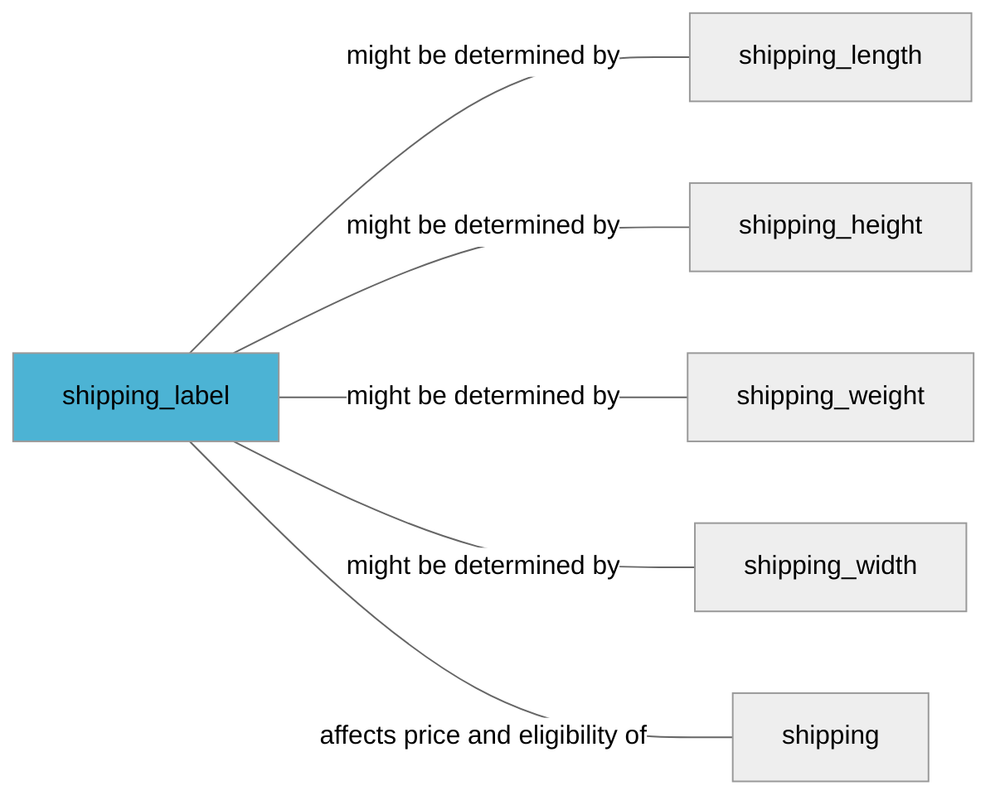

import Tabs from '@theme/Tabs';
import TabItem from '@theme/TabItem';
import Anchor from "@site/src/components/anchor"
import Field from '@site/docs/partials/_field.mdx';
import ReactMarkdown from 'react-markdown';
import ChangeLog from '@site/src/components/changelog';
import OptionalField from '@site/docs/partials/_optional_field.md';

# shipping_label

<OptionalField/>

## Description

Shipping label allows mapping your inventory to specific shipping service. Please see our [documentation for shipping services for details](https://support.prisjakt.nu/en/articles/5807189-shipping-services).


## Related Fields




## Best Practices


### Do

- Choose your own values for shipping labels based on your inventory
- Suggested types of products that should get own shipping_label: oversized products (i.e. white goods), perishable products (i.e. groceries)


## Example Values

Here are examples of how a valid *shipping_label* value  should look like in XML and CSV (with header) respectively.

<Tabs>
  <TabItem value="valid_xml" label="XML" default>

:::tip Valid Value

```xml
<g:shipping_label>bulky</g:shipping_label>
```

:::

<details>
  <summary>Click to show more valid XML examples</summary>
  <div>

```xml
<g:shipping_label>bulky</g:shipping_label>
```

```xml
<g:shipping_label>dhl/free</g:shipping_label>
```


  </div>
</details>

 </TabItem>
  <TabItem value="valid_csv" label="CSV">

:::tip Valid Value

```csv
shipping_label
bulky
```

:::

<details>
  <summary>Click to show more valid CSV examples</summary>
  <div>

```csv
shipping_label
bulky
```

```csv
shipping_label
dhl/free
```


  </div>
</details>

  </TabItem>
</Tabs>

## Error Codes

Below you will find possible error codes generated when validating this field alongside with an example in XML and CSV that would trigger the code. Please refer to the [validation rules](#validation-rules) to understand the cause.

<Tabs>
  <TabItem value="invalid_xml" label="XML" default>

:::danger <Anchor id="validation_too_many_repetitions" title="validation_too_many_repetitions" />

```xml
<g:shipping_label>a/b/c/d/e/f/g/h/i/j/k</g:shipping_label>
```

:::


 </TabItem>
  <TabItem value="invalid_csv" label="CSV">

:::danger <Anchor id="validation_too_many_repetitions" title="validation_too_many_repetitions" />

```csv
shipping_label
a/b/c/d/e/f/g/h/i/j/k
```

:::


  </TabItem>
</Tabs>

## Properties

|     **Property** |         **Value**          | **Description**                                              |
|-----------------:|:--------------------------:|:-------------------------------------------------------------|
|        Data Type |    **List[String]**     | Closest data type in code                                    |
|           Nested |      **False**      | Defines if this field consists of one or more sub-fields     |
|   Case Sensitive |  **False**  | If small or large letters matter for this field              |
|       Repeatable |    **True**    | If you can supply multiple items of this field (it´s a list) |
| Repeatable limit | **10** | If a list, this specifices the max number of items           |

## Changelog
<ChangeLog versionHistory={[{"added": ["Initial definition"], "date": "2022-12-07"}]} dateOnly={true} />

## References
- [Google Merchant Specification](https://support.google.com/merchants/answer/6324504)
