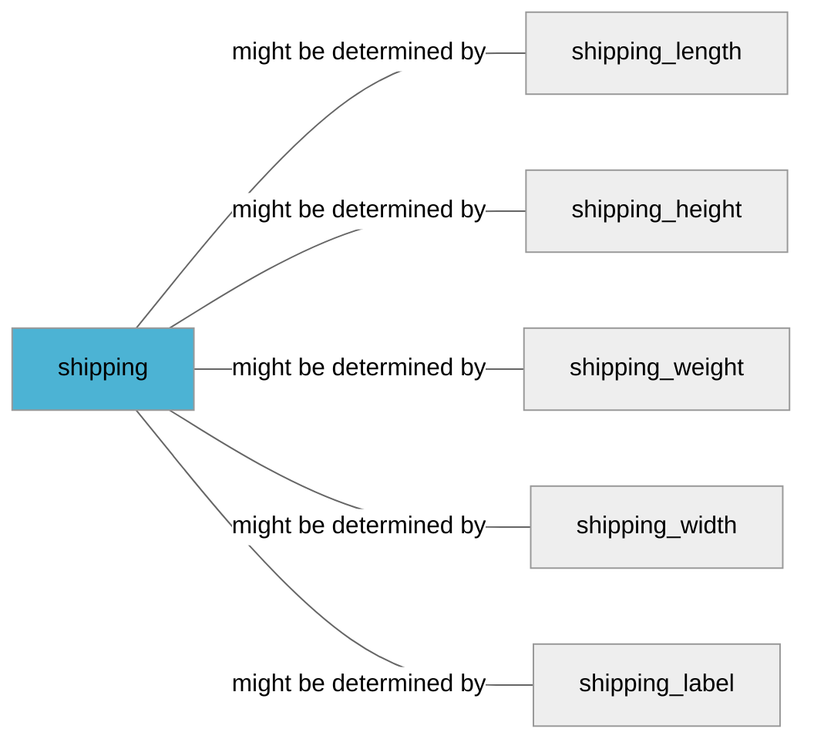

import Tabs from '@theme/Tabs';
import TabItem from '@theme/TabItem';
import Anchor from "@site/src/components/anchor"
import Field from '@site/docs/partials/_field.mdx';
import ReactMarkdown from 'react-markdown';
import ChangeLog from '@site/src/components/changelog';
import OptionalField from '@site/docs/partials/_optional_field.md';

# shipping

<OptionalField/>

## Description

The `shipping` attribute is used to set cost, time and methods of delivery. Please note, that `shipping` is **required** for all products sold on French market.


### Effects When Used

- This information will be visible for the users in offer listing.


## Related Fields




## Validation Rules

- Submit complete shipping information
- Handling time and transit time should be specified in days.
- Overestimate if you can't provide accurate shipping cost
- Submit shipping cost including VAT, use local currency
- If you provide information about handling or transit time then min_handling_time should be lesser or equal to max_handling_time and min_transit_time should be lesser or equal to max_transit_time


## Best Practices


### Do

- Keep shipping information as precise as possible. Add multiple shipping attributes if shipping cost or time varies for different country, region or service.
- If any of `min_handling_time`, `max_handling_time`, `min_transit_time`, `max_transit_time` is present then all those fields must be present for the current shipping item.


### Don´t

- Don't provide comma or point as separator for both thousands and fractional part of the shipping price, i.e. we don't support `1,000,00 SEK` and `1.000.00 SEK` formats


## Example Values

Here are examples of how a valid *shipping* value  should look like in XML and CSV (with header) respectively.

<Tabs>
  <TabItem value="valid_xml" label="XML" default>

:::tip Valid Value

```xml
<g:shipping>
  <g:country>SE</g:country>
  <g:region>Skåne</g:region>
  <g:service>Express</g:service>
  <g:price>25.00 SEK</g:price>
  <g:min_handling_time>1</g:min_handling_time>
  <g:max_handling_time>2</g:max_handling_time>
  <g:min_transit_time>1</g:min_transit_time>
  <g:max_transit_time>3</g:max_transit_time>
</g:shipping>
```

:::

<details>
  <summary>Click to show more valid XML examples</summary>
  <div>

```xml
<g:shipping>
  <g:country>SE</g:country>
  <g:region>Skåne</g:region>
  <g:service>Express</g:service>
  <g:price>25.00 SEK</g:price>
  <g:min_handling_time>1</g:min_handling_time>
  <g:max_handling_time>2</g:max_handling_time>
  <g:min_transit_time>1</g:min_transit_time>
  <g:max_transit_time>3</g:max_transit_time>
</g:shipping>
```

```xml
<g:shipping>
  <g:country>SE</g:country>
  <g:region>New York</g:region>
  <g:service>Home delivery</g:service>
  <g:price>5 SEK</g:price>
</g:shipping>
```

```xml
<g:shipping>
  <g:country>SE</g:country>
  <g:region>London</g:region>
  <g:service>Standard</g:service>
  <g:price>0 GBP</g:price>
</g:shipping>
```

```xml
<g:shipping>
  <g:country>SE</g:country>
  <g:region>Skåne</g:region>
  <g:service>Home Delivery</g:service>
  <g:price>25.00 SEK</g:price>
  <g:min_handling_time>1</g:min_handling_time>
  <g:max_handling_time>2</g:max_handling_time>
  <g:min_transit_time>1</g:min_transit_time>
  <g:max_transit_time>3</g:max_transit_time>
</g:shipping>
<g:shipping>
  <g:country>SE</g:country>
  <g:region>Skåne</g:region>
  <g:service>POST</g:service>
  <g:price>5.00 SEK</g:price>
  <g:min_handling_time>1</g:min_handling_time>
  <g:max_handling_time>5</g:max_handling_time>
  <g:min_transit_time>1</g:min_transit_time>
  <g:max_transit_time>3</g:max_transit_time>
</g:shipping>
<g:shipping>
  <g:country>SE</g:country>
  <g:region>Skåne</g:region>
  <g:service>Express</g:service>
  <g:price>45.00 SEK</g:price>
  <g:min_handling_time>1</g:min_handling_time>
  <g:max_handling_time>8</g:max_handling_time>
  <g:min_transit_time>3</g:min_transit_time>
  <g:max_transit_time>10</g:max_transit_time>
</g:shipping>
```


  </div>
</details>

 </TabItem>
  <TabItem value="valid_csv" label="CSV">

:::tip Valid Value

```csv
shipping(country:region:service:price:min_handling_time:max_handling_time:min_transit_time:max_transit_time)
SE:Skåne:DHL:25.00 SEK:1:2:1:3
```

:::

<details>
  <summary>Click to show more valid CSV examples</summary>
  <div>

```csv
shipping(country:region:service:price:min_handling_time:max_handling_time:min_transit_time:max_transit_time)
SE:Skåne:DHL:25.00 SEK:1:2:1:3
```

```csv
shipping(country:region:service:price)
SE:New York:DHL:5 SEK
```

```csv
shipping(country:region:service:price)
SE:London:DHL:0 GBP
```

```csv
shipping(country:region:service:price:min_handling_time:max_handling_time:min_transit_time:max_transit_time)
"SE:Skåne:DHL:25.00 SEK:1:2:1:3,SE:Skåne:POST:5.00 SEK:1:5:1:3,SE:Skåne:UPC:45.00 SEK:1:8:3:10"
```


  </div>
</details>

  </TabItem>
</Tabs>

## Error Codes

Below you will find possible error codes generated when validating this field alongside with an example in XML and CSV that would trigger the code. Please refer to the [validation rules](#validation-rules) to understand the cause.

<Tabs>
  <TabItem value="invalid_xml" label="XML" default>

:::danger <Anchor id="validation_missing_value" title="validation_missing_value" /> 

```xml
<g:shipping>
  <g:region>New York</g:region>
  <g:service>Express</g:service>
  <g:price>5 SEK</g:price>
  <g:min_handling_time>-1</g:min_handling_time>
</g:shipping>
```

:::

:::danger <Anchor id="validation_shipping_time_missing_values" title="validation_shipping_time_missing_values" /> 

```xml
<g:shipping>
  <g:country>SE</g:country>
  <g:region>Skåne</g:region>
  <g:service>Home</g:service>
  <g:price>5.00 SEK</g:price>
  <g:min_handling_time>1</g:min_handling_time>
</g:shipping>
```

:::


 </TabItem>
  <TabItem value="invalid_csv" label="CSV">

:::danger <Anchor id="validation_missing_value" title="validation_missing_value" /> 

```csv
shipping(country:region:service:price:min_handling_time)
:New York:Express:5 SEK:-1
```

:::

:::danger <Anchor id="validation_shipping_time_missing_values" title="validation_shipping_time_missing_values" /> 

```csv
shipping(country:region:service:price:min_handling_time)
SE:Skåne:Home:5.00 SEK:1
```

:::


  </TabItem>
</Tabs>

## Properties

|     **Property** |         **Value**          | **Description**                                              |
|-----------------:|:--------------------------:|:-------------------------------------------------------------|
|        Data Type |    **List[Nested]**     | Closest data type in code                                    |
|           Nested |      **True**      | Defines if this field consists of one or more sub-fields     |
|   Case Sensitive |  **False**  | If small or large letters matter for this field              |
|       Repeatable |    **True**    | If you can supply multiple items of this field (it´s a list) |
| Repeatable limit | **100** | If a list, this specifices the max number of items           |

## Changelog
<ChangeLog versionHistory={[{"added": ["Initial definition"], "date": "2022-12-07"}]} dateOnly={true} />

## References
- [Google Merchant Specification](https://support.google.com/merchants/answer/6324484)
