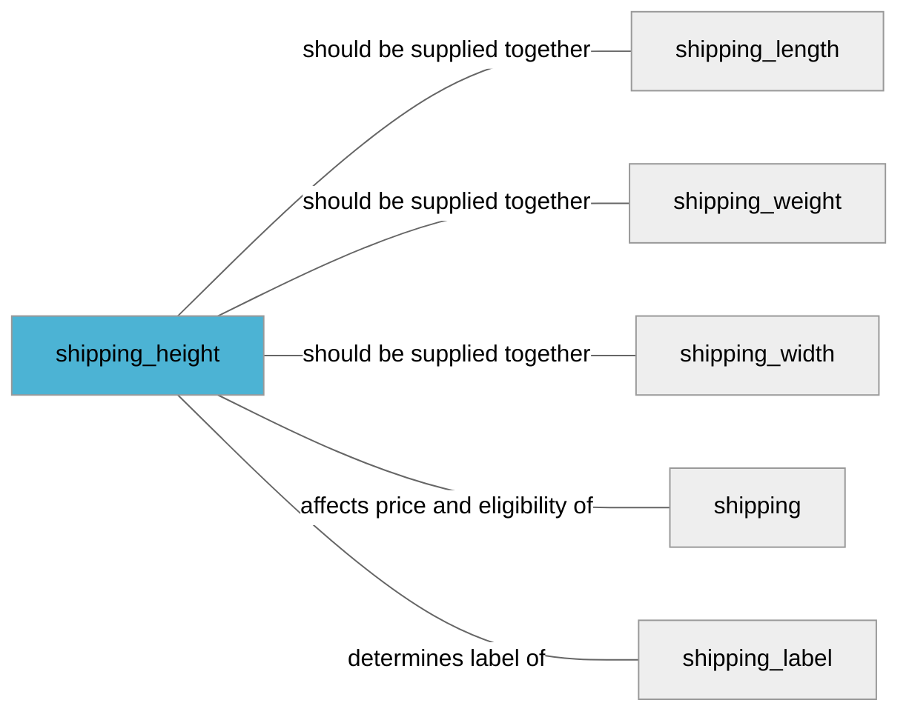

import Tabs from '@theme/Tabs';
import TabItem from '@theme/TabItem';
import Anchor from "@site/src/components/anchor"
import Field from '@site/docs/partials/_field.mdx';
import ReactMarkdown from 'react-markdown';
import ChangeLog from '@site/src/components/changelog';
import OptionalField from '@site/docs/partials/_optional_field.md';

# shipping_height

<OptionalField/>

## Description

It is recommended to add this attribute if delivery costs based on dimensions.


## Related Fields




## Validation Rules

- Length must be between `1-50` characters
- Unit must be one of `cm` or `in`


## Example Values

Here are examples of how a valid *shipping_height* value  should look like in XML and CSV (with header) respectively.

<Tabs>
  <TabItem value="valid_xml" label="XML" default>

:::tip Valid Value

```xml
<g:shipping_height>10.12 cm</g:shipping_height>
```

:::

<details>
  <summary>Click to show more valid XML examples</summary>
  <div>

```xml
<g:shipping_height>10.12 cm</g:shipping_height>
```

```xml
<g:shipping_height>0 cm</g:shipping_height>
```

```xml
<g:shipping_height>0.0 in</g:shipping_height>
```

```xml
<g:shipping_height>11 cm</g:shipping_height>
```

```xml
<g:shipping_height>15.2 in</g:shipping_height>
```


  </div>
</details>

 </TabItem>
  <TabItem value="valid_csv" label="CSV">

:::tip Valid Value

```csv
shipping_height
10.12 cm
```

:::

<details>
  <summary>Click to show more valid CSV examples</summary>
  <div>

```csv
shipping_height
10.12 cm
```

```csv
shipping_height
0 cm
```

```csv
shipping_height
0.0 in
```

```csv
shipping_height
11 cm
```

```csv
shipping_height
15.2 in
```


  </div>
</details>

  </TabItem>
</Tabs>

## Error Codes

Below you will find possible error codes generated when validating this field alongside with an example in XML and CSV that would trigger the code. Please refer to the [validation rules](#validation-rules) to understand the cause.

<Tabs>
  <TabItem value="invalid_xml" label="XML" default>

:::danger <Anchor id="validation_invalid_format" title="validation_invalid_format" />

```xml
<g:shipping_height>123cm</g:shipping_height>
```

:::

:::danger <Anchor id="validation_invalid_length_unit" title="validation_invalid_length_unit" />

```xml
<g:shipping_height>2 m</g:shipping_height>
```

:::

:::danger <Anchor id="validation_invalid_value" title="validation_invalid_value" />

```xml
<g:shipping_height>unkn own</g:shipping_height>
```
```xml
<g:shipping_height>111.222.333 in</g:shipping_height>
```

:::

:::danger <Anchor id="validation_missing_value" title="validation_missing_value" />

```xml
<g:shipping_height> in</g:shipping_height>
```

:::


 </TabItem>
  <TabItem value="invalid_csv" label="CSV">

:::danger <Anchor id="validation_invalid_format" title="validation_invalid_format" />

```csv
shipping_height
123cm
```

:::

:::danger <Anchor id="validation_invalid_length_unit" title="validation_invalid_length_unit" />

```csv
shipping_height
2 m
```

:::

:::danger <Anchor id="validation_invalid_value" title="validation_invalid_value" />

```csv
shipping_height
unkn own
```
```csv
shipping_height
111.222.333 in
```

:::

:::danger <Anchor id="validation_missing_value" title="validation_missing_value" />

```csv
shipping_height
 in
```

:::


  </TabItem>
</Tabs>

## Properties

|     **Property** |         **Value**          | **Description**                                              |
|-----------------:|:--------------------------:|:-------------------------------------------------------------|
|        Data Type |    **string**     | Closest data type in code                                    |
|           Nested |      **False**      | Defines if this field consists of one or more sub-fields     |
|   Case Sensitive |  **False**  | If small or large letters matter for this field              |
|       Repeatable |    **False**    | If you can supply multiple items of this field (it´s a list) |
| Repeatable limit | **0** | If a list, this specifices the max number of items           |

## Changelog
<ChangeLog versionHistory={[{"added": ["Initial definition"], "date": "2022-12-07"}]} dateOnly={true} />

## References
- [Google Merchant Specification](https://support.google.com/merchants/answer/6324498?hl=en-GB&ref_topic=6324338)
