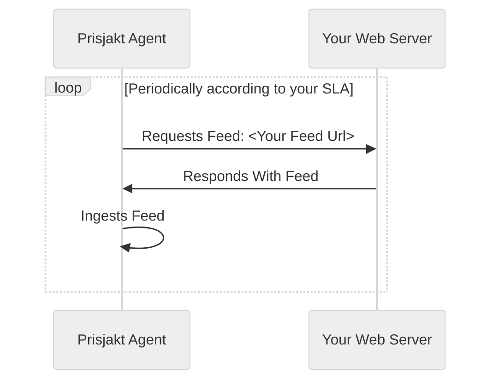
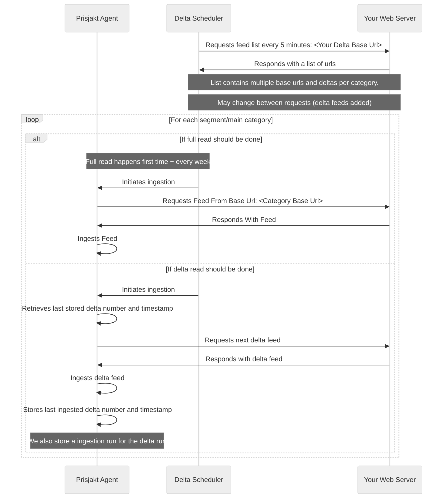

# Methods Of Delivery

There are multiple ways to get your price offerings into Prisjakt and which one you should choose depends on the size of your shop, how frequent you wan´t to update and other properties.

In general these methods can be categorized into two categories:

- **Pull based** where we fetch offers from you on regular intervals or when changes are detected
- **Push based** where you send offers to us when something changes

## Pull Based

### Feeds

A feed is a file containing the *full inventory* of your shop in it´s current state. It´s read by our agents periodically based on you SLA agreement.

#### Advantages

- Simple to setup

#### Disadvantages

- Full inventory every time
- Lots of extra unnecessary work
- Slow average time for price update (depends on SLA schedule, but in the magnitude of of hours)
- Not suitable for large volumes (> millions)

#### Flow

### Delta Feeds

Delta feeds is a way of splitting up your inventory to a base feed and then periodically supplying small files with only the changes. This improves the amount of offers and the average time for offer updates by just sending the information changed.

Delta files can be read at a higher frequency and contains offers + an `action field` for each offer that specifies if the offer should be `added/updated/removed`.

#### Advantages

- Can handle large volumes (> millions of offers)
- Average time for price update is low (< 10min)

#### Disadvantages

- Complex for to setup (requires work on webserver to produce delta files)

#### Flow

### Scraping

## Push Based

:::info Proposals

Push based methods are not yet supported but are being considered, please contact us if you are interested in these ways of delivery and would like to be a pilot.

:::

### Message Based

In this approach you would send a message to us via a queue system on each change of your offers.

#### Advantages

- Direct updates of offers
- Efficient data handling (less data processed, better compression on protocols)

#### Disadvantages

- Would require deep integration with your shops system

### REST Based

In this approach you would send a REST request to us on each change of your offers.

#### Advantages

- Direct updates of offers

#### Disadvantages

- Would require deep integration with your shops system