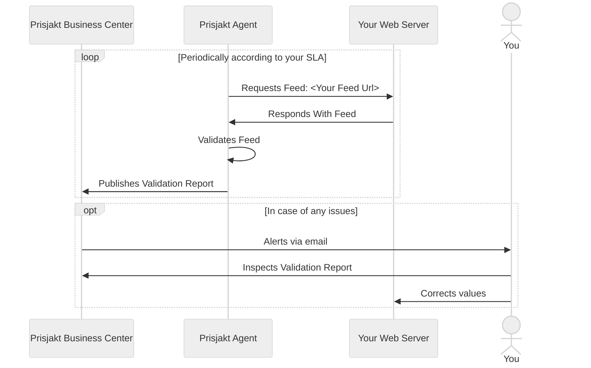

# Methods Of Delivery

There are multiple ways to get your price offerings into Prisjakt and which one you should choose depends on the size of your shop, how frequent you wan´t to update and other properties.

In general these methods can be categorized into two categories:

- **Pull based** where we fetch offers from you on regular intervals or when changes are detected
- **Push based** where you send offers to us when something changes

## Pull Based

### Single File Full Feeds

### Delta Feeds

### Scraping

## Push Based

:::info Proposals

Push based methods are not yet supported but considered, please contact us if you are interested in these ways of delivery.

:::

### Message Based Updates

### REST Based Updates