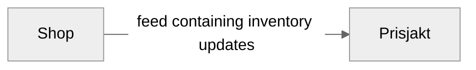

# What Is a Feed?

A product feed is a way for you as a shop to give Prisjakt structured information about your inventory so that we can present you products in the best possible way on our site. Most often, a feed consists of a [single file](/types-of-feeds/pull/feed.md) in either [XML or CSV format](/types-of-feeds/file-formats/index.md). But depending on the size of your inventory, the speed of updates and other more advanced features a feed can also be constructed in [other more suitable ways](/types-of-feeds/index.md).

