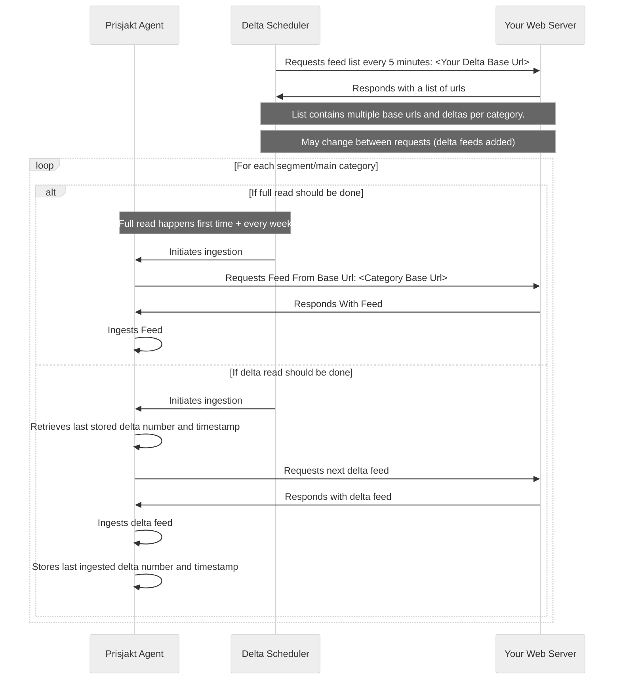

# Delta Feeds

Delta feeds is a way of splitting up your inventory to a base feed and then periodically supplying small files with only the changes. This improves the amount of offers and the average time for offer updates by just sending the information changed.

Delta files can be read at a higher frequency and contains offers + an `action field` for each offer that specifies if the offer should be `added/updated/removed`.

To get started with delta feeds please contact our support at support@prisjakt.nu.

## Advantages

- Can handle large volumes (> millions of offers)
- Average time for price update is low

## Disadvantages

- Complex for to setup since it requires work on webserver to produce delta files

## Expected File Structure

```bash
my-delta-feed
├── 2019-05-28-full
│   ├── 2019-05-28-1.md
│   ├── 2019-05-28-2.md
│   └── 2020-05-28-3.md
├── 2019-05-29-full
│   ├── 2019-05-29-1.md
│   ├── 2019-05-29-2.md
│   └── 2020-05-29-3.md
└── index
```

## Flow

