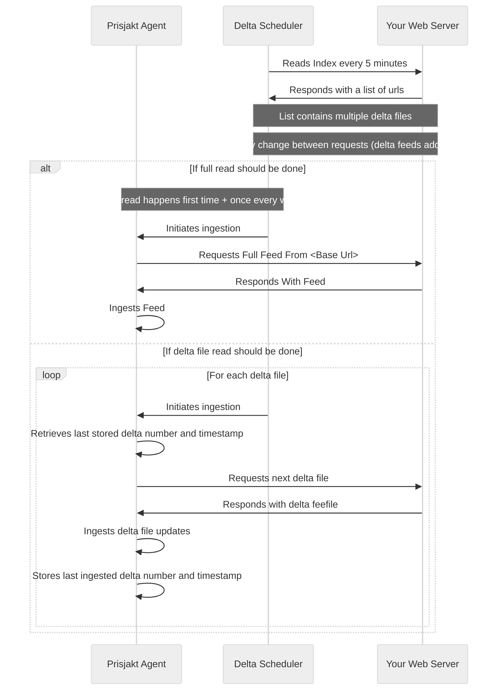

# Delta Feeds

Delta feeds is a way of splitting up your inventory to a base feed and then periodically supplying small files with only the changes. This improves the amount of offers and the average time for offer updates by just sending the information changed.

Delta files can be read at a higher frequency and contains a [delta_command](/docs/fields/offer/delta_command.md) plus changed fields for each offer.

Delta feeds consists of three components:

- **Index file** a list that specifies that delta files exist and when they where updated
- **Base feed** this is the full inventory feed with all offers and all information, read at a slower pace
- **Delta files** small files generated often that contains a [delta_command](/docs/fields/offer/delta_command.md) plus changes only

## Advantages

- Can handle large volumes (> millions of offers)
- Average time for price update is low

## Disadvantages

- Complex for to setup since it requires work on webserver to produce delta files

## Base Feed

The base feed should contain full inventory and full offer inventory and be generated once per week.

## Index File

The file index is a way for us to get an overview from you what changes exist since our last poll. This should be reset once every week when the [base feed](#base-feed) is re-generated.

```xml
<?xml version='1.0' encoding='UTF-8'?>
<delta_feed>
  <base_file>2023-01-12-base.xml</base_file>
  <delta_files>
    <item>
      <filename>2023-01-12-delta-1.xml</filename>

      <!--iso 8601 timestamp-->
      <updated_timestamp>2023-01-12T10:17:30+01:00</updated_timestamp>
    </item>
    <item>
      <filename>2023-01-12-delta-2.xml</filename>
      <updated_timestamp>2023-01-12T11:17:30+01:00</updated_timestamp>
    </item>
    <item>
      <filename>2023-01-12-delta-3.xml</filename>
      <updated_timestamp>2023-01-12T12:17:30+01:00</updated_timestamp>
    </item>

    <!--file list continues as new delta files gets created -->

  </delta_files>
</delta_feed>  
```

## Expected File Structure

- Index file always have the same name: `index-file.xml`
- Base feed should follow pattern `yyyy-MM-dd-base.xml` with the date it was generated
- Delta files should follow pattern `yyyy-MM-dd-delta-X.xml` where date is the **date of the base feed** the delta file belongs to and `X` is an increasing counter

```bash
├── 2023-01-12-base.xml
├── 2023-01-12-delta-1.xml
├── 2023-01-12-delta-2.xml
├── 2023-01-12-delta-3.xml
└── index-file.xml
```

## Delta File

```xml
<?xml version='1.0' encoding='UTF-8'?>
<rss xmlns:pj="https://schema.prisjakt.nu/ns/1.0" xmlns:g="http://base.google.com/ns/1.0" version="3.0">
  <channel>
    <title>Prisjakt Delta File</title>
    <description>This is an example delta file which updates partial data</description>
    <link>https://schema.prisjakt.nu</link>


    <!-- Update sale_price and sale_price_effective_date on an offer -->
    <item>
      <pj:delta_command>upsert</pj:delta_command>
      <g:id><![CDATA[213888]]></g:id>
      <g:sale_price>89.99 SEK</g:sale_price>
      <g:sale_price_effective_date>2016-02-24T13:00:00-08:00/2016-02-29T15:30:00+02:00</g:sale_price_effective_date>
    </item>

    <!-- Remove an offer -->
    <item>
      <pj:delta_command>remove</pj:delta_command>
      <g:id><![CDATA[12345]]></g:id>
    </item>

    <!-- Insert new -->
    <item>
      <g:delta_command>upsert</g:delta_command>
      <g:condition>new</g:condition>
      <g:google_product_category>1144</g:google_product_category>
      <g:id><![CDATA[213889]]></g:id>
      <g:link>http://example.com/link</g:link>
      <g:price>99.99 SEK</g:price>
      <g:title><![CDATA[Samsung Galaxy S8 Black 128G]]></g:title>
    </item>

  </channel>
</rss>
```

## Flow

