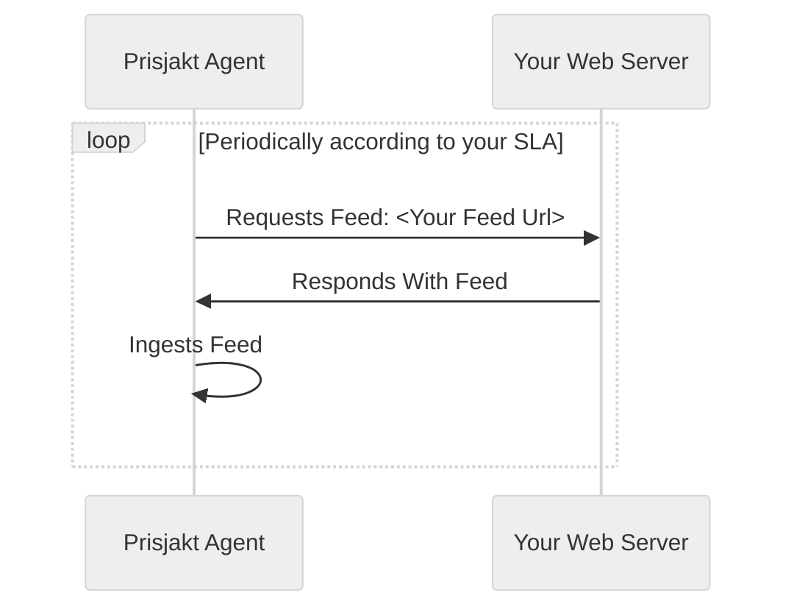

# Feeds

A feed is a file containing the *full inventory* of your shop in it´s current state. It´s read by our agents periodically based on you SLA agreement.

## Advantages

- Simple to setup

## Disadvantages

- Full inventory every time
- Lots of extra unnecessary work
- Slow average time for price update (depends on SLA schedule, but in the magnitude of of hours)
- Not suitable for large volumes (> millions)

#### Flow

