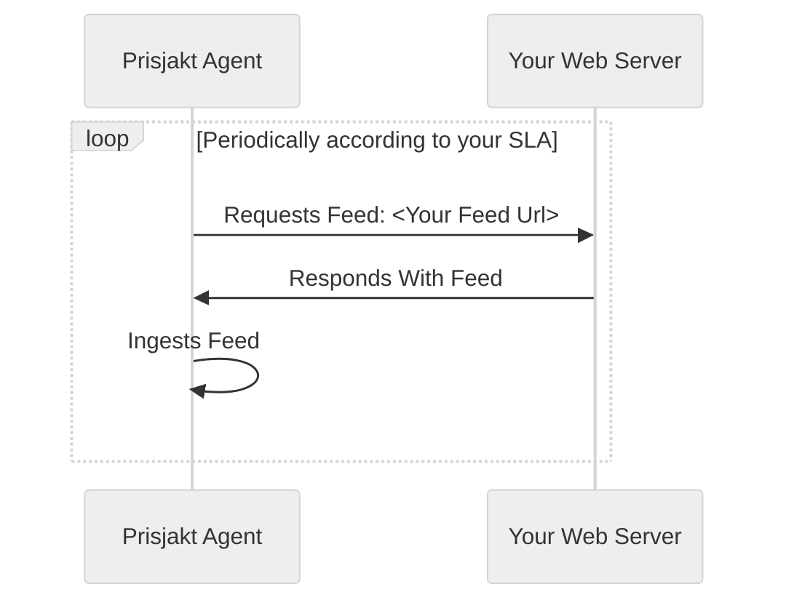

# Feeds

A single file feed is a file containing the *full inventory* of your shop in it´s current state. It´s read by our agents periodically based on you SLA agreement. You can see examples of this type of feeds in the [examples section](/examples).

## Advantages

- Simple to setup
- Full inventory every time

## Disadvantages

- Lots of extra unnecessary work is done (offers that have not updated are still sent and processed)
- Slow average time for price update (depends on SLA schedule, but in the magnitude of of hours)
- Not suitable for large volumes (> millions)

## Flow

